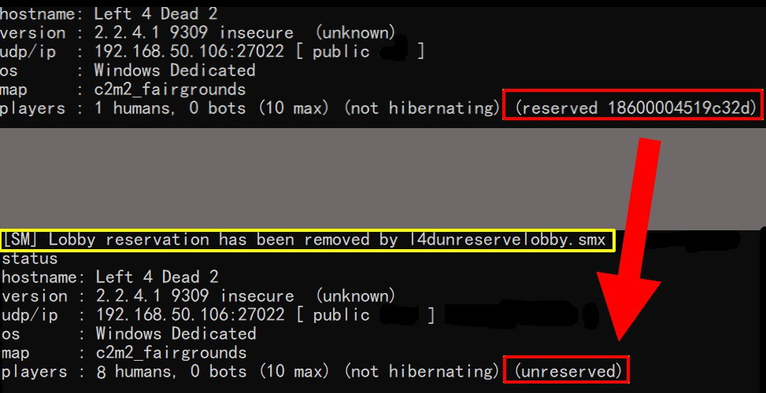

# Description | 內容
Removes lobby reservation when server is full or empty

> __Note__ 
<br/>🟥Dedicated Server Only
<br/>🟥只能安裝在Dedicated Server

* Video | 影片展示
<br/>None

* Image | 圖示
<br/>

* <details><summary>How does it work?</summary>

	* (Before) 
		1. If server is lobby reserved and full in gamemode (8 for versus/scavenge lobby, 4 for survival/coop/realism lobby)
			* New players can't join the server even if server still has remaining slots, they can't connect via the console or server browser
		2. If server is lobby reserved and empty (No one in server)
			* Unable to connect server from lobby
	* (After)
		1. Removes lobby reservation once server is full in gamemode (8 for versus/scavenge lobby, 4 for survival/coop/realism lobby)
			* New players is allowed to join the server, they can connect via the console or server browser
			* It won't restore back lobby reservation
		2. Removes lobby reservation once all players have disconnected
			* Players can connect from a lobby again
			* It won't restore back lobby reservation
	* In short, if you want multi slots server, must install
		1. This l4d_unreservelobby plugin
		2. And **l4dtoolz** (see Require below)
</details>

* Require
	1. [left4dhooks](https://forums.alliedmods.net/showthread.php?t=321696)
	2. To open more server slots, you must install [l4dtoolz](https://github.com/fbef0102/Game-Private_Plugin/tree/main/Tutorial_%E6%95%99%E5%AD%B8%E5%8D%80/English/Server/Install_Other_File#l4dtoolz)

* <details><summary>ConVar | 指令</summary>

	* cfg/sourcemod/l4d_unreservelobby.cfg
		```php
		// Automatically unreserve server after all playes have disconnected
		l4d_unreservelobby_empty "1"

		// Automatically unreserve server after server lobby reserved and full in gamemode (8 in versus/scavenge, 4 in coop/survival/realism)
		l4d_unreservelobby_full "1"
		```
</details>

* <details><summary>Command | 命令</summary>

	* **sm_unreserve - manually force removes the lobby reservation (Adm required: ADMFLAG_ROOT)**
		```php
		sm_unreserve
		```
</details>

* Apply to | 適用於
	```
	L4D1
	L4D2
	```

* <details><summary>Changelog | 版本日誌</summary>

	* v1.0h (2024-10-3)
		* Remake code, convert code to latest syntax
		* Fix warnings when compiling.
		* Replace Gamedata with left4dhooks
		* Automatically unreserve server after all playes have disconnected

	* v1.1.1
		* [Original plugin By Downtown1](https://forums.alliedmods.net/showthread.php?t=94415)
</details>

- - - -
# 中文說明
移除伺服器的大廳人數限制，簡單講就是解鎖伺服器，讓第九位以上的玩家透過IP或伺服器瀏覽加入伺服器

* <details><summary>原理</summary>

	* (裝插件之前)
		1. 當伺服器有大廳reserved cookie且模式滿人時(對抗/清道夫: 8人已滿, 戰役/生存/寫實: 4人已滿)
			* 其他玩家均不能再加入伺服器，即使有設置伺服器30個位子依然無法加入
		2. 當伺服器有大廳reserved cookie且沒人時(所有玩家已離開)
			* 無法從大廳匹配到伺服器

	* (裝插件之後)
		1. 當伺服器有大廳reserved cookie且模式滿人時(對抗/清道夫: 8人已滿, 戰役/生存/寫實: 4人已滿)，自動移除動態大廳reserved cookie，不再恢復
			* 其他玩家可透過IP直連或是伺服器瀏覽加入遊戲
		2. 當伺服器所有玩家離開沒人時，自動移除大廳reserved cookie，不再恢復
			* 玩家可以再次從大廳匹配到伺服器

	* 總結白話講: 當你想開多人伺服器時，需要安裝
		1. 此插件
		2. 與**l4dtoolz** (查看下方"必要安裝")
</details>

* 必要安裝
	1. [left4dhooks](https://forums.alliedmods.net/showthread.php?t=321696)
	2. [l4dtoolz](https://github.com/fbef0102/Game-Private_Plugin/tree/main/Tutorial_教學區/Chinese_繁體中文/Server/安裝其他檔案教學#安裝l4dtoolz): 解鎖伺服器人數限制

* <details><summary>問題Q&A</summary>

	* 怎麼開多人房?
		* [教學文章](https://github.com/fbef0102/Game-Private_Plugin/tree/main/Tutorial_%E6%95%99%E5%AD%B8%E5%8D%80/Chinese_%E7%B9%81%E9%AB%94%E4%B8%AD%E6%96%87/Game/L4D2/8%E4%BD%8D%E7%8E%A9%E5%AE%B6%E9%81%8A%E7%8E%A9%E6%88%B0%E5%BD%B9%E6%A8%A1%E5%BC%8F)

	* 什麼是大廳匹配?
		* [開大廳，匹配](https://github.com/fbef0102/Game-Private_Plugin/tree/main/Tutorial_教學區/Chinese_繁體中文/Server/安裝伺服器與插件#如何從大廳匹配到專屬伺服器)

	* 什麼是大廳reserved cookie?
		1. 中文是預定的餅乾(X)，類似去飯店預設房間，已經被訂走的房間無法給其他人入住
		2. 不用想太多這名詞，直接看有無大廳reserved cookie的差別
		3. 詳細功能依然有很多未解之謎，問就是Valve的鍋，我們吃瓜就好

	* 有大廳reserved cookie時
		1. 模式滿人時 (對抗/清道夫: 8人, 戰役/生存/寫實: 4人)，其他玩家均不能再加入伺服器，即使伺服器設置30個位子依然無法加入
			* 無法直連
			* 無法加入好友房間
			* 無法從伺服器瀏覽加入
			* 伺服器停止吸路人匹配進來
		2. 無人時 (所有玩家已離開)
			* 無法從大廳匹配
			* 伺服器停止吸路人匹配進來
		3. 模式沒有滿人時
			* 伺服器會吸路人匹配進來

	* 無大廳reserved cookie時
		1. 模式滿人時(對抗/清道夫: 8人, 戰役/生存/寫實: 4人)，其他玩家可以加入伺服器
			* 可直連
			* 可加入好友房間
			* 可從伺服器瀏覽加入
			* 伺服器停止吸路人匹配進來
		2. 無人時(所有玩家已離開)
			* 可從大廳匹配
			* 伺服器停止吸路人匹配進來
		4. 模式沒有滿人時
			* 如果第一個玩家是從大廳匹配，伺服器會吸路人匹配進來
			* 如果第一個玩家不是從大廳匹配，伺服器停止吸路人匹配進來

	* 何時會有大廳reserved cookie?
		1. 設置指令```sv_allow_lobby_connect_only 1```，且第一位玩家透過以下方式加入伺服器
			* 直連
			* 從伺服器瀏覽加入
			* 大廳匹配

		2. 設置指令```sv_allow_lobby_connect_only 0```，且第一位玩家透過以下方式加入伺服器
			* 大廳匹配

	* 怎麼知道伺服器有大廳reserved cookie?
		1. 遊戲控制台或伺服器後台輸入```status```，如果看到reserved xxxxx，那就是有，反之亦然

	> 以上如有錯誤，歡迎聯繫告知
</details>

* <details><summary>指令中文介紹 (點我展開)</summary>

	* cfg/sourcemod/l4d_unreservelobby.cfg
		```php
		// 當所有玩家離開伺服器且伺服器沒人時，自動移除大廳reserved cookie
		l4d_unreservelobby_empty "1"

		// 當伺服器有大廳reserved cookie且模式滿人時(對抗/清道夫: 8人已滿, 戰役/生存/寫實: 4人已滿)，自動移除動態大廳reserved cookie
		l4d_unreservelobby_full "1"
		```
</details>

* <details><summary>命令中文介紹 (點我展開)</summary>

	* **sm_unreserve - 輸入此指令手動移除大廳reserved cookie (權限: ADMFLAG_ROOT)**
		```php
		sm_unreserve
		```
</details>