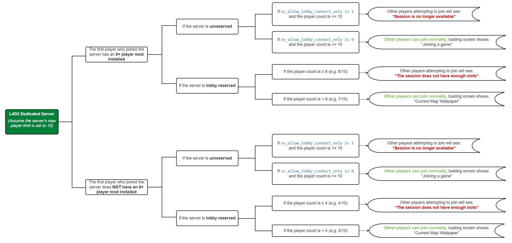

# Description | 內容
Removes lobby reservation when server is full, allow 9+ players to join server

> __Note__ 
<br/>🟥Dedicated Server Only
<br/>🟥只能安裝在Dedicated Server

* Apply to | 適用於
	```
	L4D1 Dedicated Server
	L4D2 Dedicated Server
	```

* Image | 圖示
<br/>

* <details><summary>How does it work?</summary>

	* (Before) 
		1. If server is lobby reserved and full in gamemode (8 for versus/scavenge lobby, 4 for survival/coop/realism lobby)
			* New players can't join the server even if server still has remaining slots, they can't connect via the console or server browser
		2. If server is lobby reserved and empty (No one in server)
			* Unable to connect server from lobby
	* (After)
		1. Automatically removes lobby reservation once server is full in gamemode (8 for versus/scavenge lobby, 4 for survival/coop/realism lobby)
			* New players is allowed to join the server, they can connect to server via the console or server browser
			* Automatically Set ```sv_allow_lobby_connect_only 0```
		2. Automatically Removes lobby reservation once all players have disconnected
			* Players can connect from a lobby again
			* Automatically Set ```sv_allow_lobby_connect_only``` back to default
	* In short, if you want to play multi slots server, must install
		1. This l4d_unreservelobby plugin
		2. And **l4dtoolz** (see Require below)
</details>

* Require
	1. [left4dhooks](https://forums.alliedmods.net/showthread.php?t=321696)
	2. [l4dtoolz](https://github.com/fbef0102/Game-Private_Plugin/tree/main/Tutorial_%E6%95%99%E5%AD%B8%E5%8D%80/English/Server/Install_Other_File#l4dtoolz): Unlock more than 8 slots

* <details><summary>Q&A</summary>

	* How to install 8+ slots coop/versus server?
		* [Read this](https://github.com/fbef0102/Game-Private_Plugin/tree/main/Tutorial_%E6%95%99%E5%AD%B8%E5%8D%80/English/Game/L4D2/8+_Survivors_In_Coop)

	* What is lobby reserved?
		* Create a lobby -> Server Type: ```Best Avaliable Dedicated``` -> Types ```mm_dedicated_force_servers xxxxxx``` in game console -> Start The Game
			* xxxxx is ip
		* The dedicated server will register with **Steam master server**, and Steam master will send the reserved cookie to your dedicated server
		* Steam master server always tracks and checks your server if your server keeps reserved.
		* Once your server is reserved and not full, Steam master server will try to send random players to your server via matchmaking (finding random game)
	
	* How to check if server is reserved?
		* Type ```status``` in server console
			* If you see ```(reserved xxxxxxx)```, then server is reserved
			* If you see ```(unreserved)```, then server is unreserved

	* What is ```heartbeat``` command?
		* All it does is to force updated server status to steam master server (Such as amount of players, latency and so fort, useful for matchmaking and serverbrowser). 
		* Basically yelling to master server "HEY, I'M STILL ALIVE AND PLEASE GIVE ME PLAYERS"
</details>

* <details><summary>ConVar | 指令</summary>

	* cfg/sourcemod/l4d_unreservelobby.cfg
		```php
		// Automatically unreserve server after server lobby is full in gamemode (8 in versus/scavenge, 4 in coop/survival/realism)
		l4d_unreservelobby_full "1"

		// When player number reaches the following number, server unreserves.
		// 0 = 8 in versus/scavenge, 4 in coop/survival/realism.
		// >0 = Any number greater than zero.
		l4d_unreservelobby_trigger "0"

		// Time interval to send heartbeat command to steam master server if server lobby is not full and reserved (0=Off)
		// Check "Q&A" above if you want to know what heartbeat command is
		l4d_unreservelobby_heartbeat_interval "30.0"
		```
</details>

* <details><summary>Command | 命令</summary>

	* **sm_unreserve - manually force removes the lobby reservation (Adm required: ADMFLAG_ROOT)**
		```php
		sm_unreserve
		```
</details>

* <details><summary>Changelog | 版本日誌</summary>

	* v1.7h (2025-5-12)
	* v1.6h (2025-2-17)
	* v1.5h (2025-2-13)
	* v1.4h (2024-12-28)
		* Update cvars

	* v1.3h (2024-12-20)
	* v1.2h (2024-12-17)
		* Fixed unreserved delay error

	* v1.1h (2024-10-26)
		* Add ```sv_allow_lobby_connect_only 0``` when unreserved
		* Update cvars

	* v1.0h (2024-10-3)
		* Remake code, convert code to latest syntax
		* Fix warnings when compiling.
		* Replace Gamedata with left4dhooks
		* Automatically unreserve server after all playes have disconnected

	* v1.1.1
		* [Original plugin By Downtown1](https://forums.alliedmods.net/showthread.php?t=94415)
</details>

- - - -
# 中文說明
移除伺服器的大廳人數限制，簡單講就是解鎖伺服器，讓第九位以上的玩家可以加入伺服器

* <details><summary>原理</summary>

	* (裝插件之前)
		1. 當伺服器有大廳reserved cookie且模式滿人時(對抗/清道夫: 8人已滿, 戰役/生存/寫實: 4人已滿)
			* 其他玩家均不能再加入伺服器，即使有設置伺服器30個位子依然無法加入
		2. 當伺服器有大廳reserved cookie且沒人時(所有玩家已離開)
			* 無法從大廳匹配到伺服器

	* (裝插件之後)
		1. 當伺服器有大廳reserved cookie且模式滿人時(對抗/清道夫: 8人已滿, 戰役/生存/寫實: 4人已滿)
			* 自動移除動態大廳reserved cookie
			* 設置指令```sv_allow_lobby_connect_only 0```
			* 其他玩家可透過IP直連或是伺服器瀏覽加入遊戲
		2. 當伺服器所有玩家離開沒人時，自動移除大廳reserved cookie，不再恢復
			* 玩家可以再次從大廳匹配到伺服器
			* 指令 ```sv_allow_lobby_connect_only``` 恢復預設

	* 總結白話講: 當你想開多人伺服器時，需要安裝
		1. 此插件
		2. 與**l4dtoolz** (查看下方"必要安裝")
</details>

* 必要安裝
	1. [left4dhooks](https://forums.alliedmods.net/showthread.php?t=321696)
	2. [l4dtoolz](https://github.com/fbef0102/Game-Private_Plugin/tree/main/Tutorial_教學區/Chinese_繁體中文/Server/安裝其他檔案教學#安裝l4dtoolz): 解鎖伺服器人數限制

* <details><summary>問題Q&A</summary>

	* 怎麼開多人房?
		* [教學文章](https://github.com/fbef0102/Game-Private_Plugin/tree/main/Tutorial_%E6%95%99%E5%AD%B8%E5%8D%80/Chinese_%E7%B9%81%E9%AB%94%E4%B8%AD%E6%96%87/Game/L4D2/8%E4%BD%8D%E7%8E%A9%E5%AE%B6%E9%81%8A%E7%8E%A9%E6%88%B0%E5%BD%B9%E6%A8%A1%E5%BC%8F)

	* 什麼是大廳匹配?
		* [開大廳，匹配](https://github.com/fbef0102/Game-Private_Plugin/tree/main/Tutorial_教學區/Chinese_繁體中文/Server/安裝伺服器與插件#如何從大廳匹配到專屬伺服器)

	* 什麼是大廳reserved cookie?
		1. 中文是預定的餅乾(X)，表示飯店已預設房間，已經被訂走的房間無法給其他人入住
		2. 當專屬伺服器被大廳匹配時，會註冊至**Steam Master Server**(也就是Steam主伺服器)，Steam Master會產生一串代碼給專屬伺服器，此代碼就是reserved cookie
		3. 只要你的專屬伺服器保持reserved，Steam Master就會持續追蹤並檢查你的專屬伺服器狀態
		4. 當Steam Master發現你伺服器狀態是reserved且還有空位時，就會持續吸引路人進來 (路人找遊戲匹配時會被騙進來的意思)

	* 怎麼知道伺服器有大廳reserved cookie?
		1. 遊戲控制台或伺服器後台輸入```status```，如果看到```(reserved xxxxx)```，那就是有，反之亦然

	* 有大廳reserved cookie時
		1. 模式沒有滿人時
			* 伺服器會吸路人匹配進來
		2. 模式滿人時 (對抗/清道夫: 8人, 戰役/生存/寫實: 4人)，其他玩家均不能再加入伺服器，即使伺服器設置30個位子依然無法加入
			* 無法直連
			* 無法加入好友房間
			* 無法從伺服器瀏覽加入
			* 伺服器停止吸路人匹配進來

	* 無大廳reserved cookie時
		1. 模式沒有滿人時
			* 伺服器停止吸路人匹配進來
		2. 模式滿人時(對抗/清道夫: 8人, 戰役/生存/寫實: 4人)，其他玩家可以加入伺服器
			* 可直連
			* 可加入好友房間
			* 可從伺服器瀏覽加入
			* 伺服器停止吸路人匹配進來

	* 何時會有大廳reserved cookie?
		1. 設置指令```sv_allow_lobby_connect_only 1```，且第一位玩家透過以下方式加入伺服器
			* 直連```connect```
			* 從```openserverbrowser列表```或```steam群組伺服器```瀏覽加入
			* 大廳匹配

		2. 設置指令```sv_allow_lobby_connect_only 0```，且第一位玩家透過以下方式加入伺服器
			* 大廳匹配

	* ```sv_allow_lobby_connect_only```與大廳之間的關係圖, [圖來源: Hatsune-Imagine/l4d2-plugins/l4d2_unreservelobby](https://github.com/Hatsune-Imagine/l4d2-plugins/tree/main/l4d2_unreservelobby)
	<br/>

	* 什麼是 ```heartbeat``` 指令?
		* 強制更新伺服器狀態至 Steam Master Server (譬如: 玩家數量、延遲、地區...). 
		* 告訴 Steam Master "嘿! 我這伺服器還他馬活著，請分配路人玩家給我"

	> 詳細功能依然有很多未解之謎，問就是Valve的鍋，我們吃瓜就好
</details>

* <details><summary>指令中文介紹 (點我展開)</summary>

	* cfg/sourcemod/l4d_unreservelobby.cfg
		```php
		// 當伺服器有大廳reserved cookie且模式滿人時(對抗/清道夫: 8人已滿, 戰役/生存/寫實: 4人已滿)，自動移除動態大廳reserved cookie
		l4d_unreservelobby_full "1"

		// 當伺服器內玩家人數達到以下數值, 則移除動態大廳reserved cookie.
		// 0 = 對抗/清道夫下8人, 戰役/生存/寫實下4人
		// >0 = 任何大於0的自定義人數
		l4d_unreservelobby_trigger "0"

		// (如果伺服器是reserved且還有空位的時候) 每隔一段時間傳送 heartbeat 指令，將伺服器狀態更新至Steam Master Server
		// (0=關閉此功能, heartbeat指令介紹 請查看上方問題Q&A)
		l4d_unreservelobby_heartbeat_interval "30.0"
		```
</details>

* <details><summary>命令中文介紹 (點我展開)</summary>

	* **sm_unreserve - 輸入此指令手動移除大廳reserved cookie (權限: ADMFLAG_ROOT)**
		```php
		sm_unreserve
		```
</details>