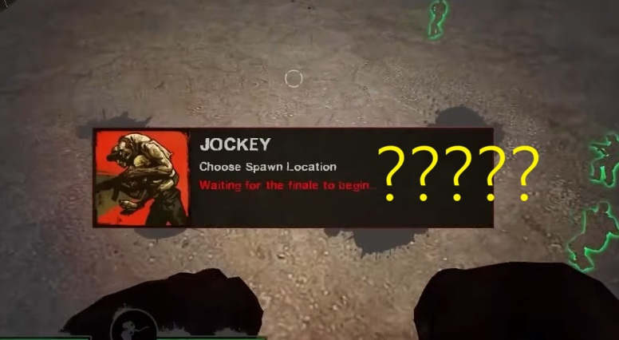
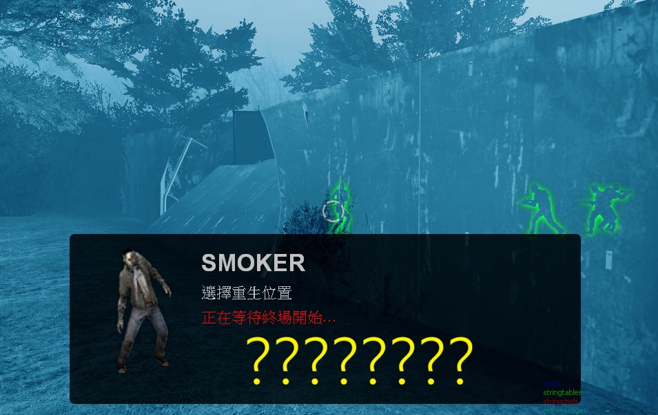

# Description | 內容
Fixing ghost infected spawn bug "Waiting For the finale to begin"

* Apply to | 適用於
	```
	L4D1
	L4D2
	```

* Image | 圖示
	* WTF, Valve
	<br/>

* <details><summary>How does it work?</summary>

	* Usually happen in some custom maps
		* When you play infected team on the second round in versus mode, unable to spawn due to a bullshit bug "Waiting For the finale to begin"
		* For Example: Urban Flight map 4
</Chargedetails>

* Require | 必要安裝
	1. [left4dhooks](https://forums.alliedmods.net/showthread.php?t=321696)

* <details><summary>Command | 命令</summary>

	* **Manually fix the 'Waiting for finale to start' issue for all infected. (Adm required: ADMFLAG_GENERIC)**
		```php
		sm_fix_wff
		```
</details>

* <details><summary>Changelog | 版本日誌</summary>

	* v1.0h (2026-2-16)
		* 一勞永逸的版本，不需要自己在手動新增地圖
		* A permanent solution that doesn't require manually adding maps anymore
		* Remake code

	* v1.3.0
		* [Plugin by ProdigySim, modified by Wicket and devilesk](https://github.com/devilesk/rl4d2l-plugins/blob/master/suicideblitzfinalefix.sp)
</details>

- - - -
# 中文說明
管理員可以強制暫停遊戲，也只有管理員能解除暫停

* 圖示
	* 愚蠢的Valve
	

* 原理
	* 通常發生於三方圖，地圖沒有做好支援對抗
		* 對抗模式的第二回合開始後，因為一個莫名其妙的bug而無法重生，螢幕上會顯示「正在等待終場開始...」
		* 譬如: Urban Flight 第四關


