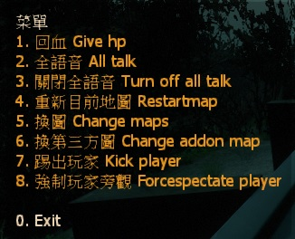

# Description | 內容
L4D1/2 Vote Menu (Change map、Kick、Restart、Give HP、Alltalk)

* Video | 影片展示
<br/>None

* Image | 圖示
	* Vote Menu
        > 投票介面
	    <br/>

* Apply to | 適用於
    ```
    L4D1
    L4D2
    ```

* <details><summary>Changelog | 版本日誌</summary>

	* v6.0 (2022-12-5)
        * Remake Code
        * Changes to fix warnings when compiling on SourceMod 1.11.
        * Fix errors

	* v1.0
        * Initial Release
</details>

* Require | 必要安裝
	1. [[INC] Multi Colors](https://forums.alliedmods.net/showthread.php?t=247770)

* <details><summary>ConVar | 指令</summary>

	* cfg\sourcemod\l4d_votes_5.cfg
		```php
        // 0=Off, 1=On this plugin
        l4d_Votens "1"

        // If 1, Enable All Talk Off Vote.
        l4d_Votensalltalk2ED "1"

        // If 1, Enable All Talk On Vote.
        l4d_VotensalltalkED "1"

        // If 1, Enable Give HP Vote.
        l4d_VotenshpED "1"

        // If 1, Enable Change Custom Map Vote.
        l4d_Votensmap2ED "1"

        // If 1, Enable Change Value Map Vote.
        l4d_VotensmapED "1"

        // If 1, Enable Restart Current Map Vote.
        l4d_VotensrestartmapED "1"

        // If 1, Enable ForceSpectate Player Vote.
        l4d_VotesForceSpectateED "1"

        // If 1, Enable Kick Player Vote.
        l4d_VotesKickED "1"

        // Players with these flags have kick immune. (Empty = Everyone, -1: Nobody)
        l4d_VotesKick_immue_access_flag "z"

        // Minimum # of players in game to start the vote
        sm_vote_player_limit "2"

        // pass vote percentage.
        sm_votes_s "0.60"
		```
</details>

* <details><summary>Command | 命令</summary>

	* **Open Vote Menu**
        ```php
        sm_votes
        sm_callvote
        sm_callvotes
        ```
    
	* **Restart current level (Adm Required: ADMFLAG_CHANGEMAP)**
        ```php
        sm_restartmap
        ```
</details>

* Data Example
	* Add custom maps in data/VoteCustomCampaigns.txt
        ```php
        "VoteCustomCampaigns"
        {
            "1" //numbers
            {
                "mapinfo"		"msd1_town"  //Map Name
                "mapname"		"再见了晨茗" //Name whatever you want
            }
        }
        ```

- - - -
# 中文說明
L4D1/2 投票菜單 (換圖、踢人、重新回合、回血、全頻語音)

* 原理
    * 輸入!votes打開投票菜單
    * 必須全體玩家超過60%同意才會投票生效

* 功能
    * 可投票換三方圖
    * 可控制每個投票選項開關
    * 可調整投票通過比率
    * 可調整發起投票時伺服器內至少需要存在的玩家數量
    * 擁有特定權限的玩家不會被投票踢出遊戲

* Data設定範例
	* data/VoteCustomCampaigns.txt　新增三方地圖
        ```php
        "VoteCustomCampaigns"
        {
            "1" //數字，必須寫得有順序
            {
                "mapinfo"		"msd1_town"  //關卡地圖名
                "mapname"		"再见了晨茗" //地圖名稱，可自取
            }
        }
        ```