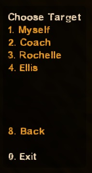
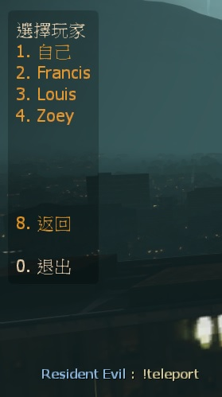

# Description | 內容
Create a survivor bot in game + Teleport player

* Video | 影片展示
<br/>None

* Image
	* teleport menu
	<br/>

* Apply to | 適用於
```
L4D1
L4D2
```

* Translation Support | 支援翻譯
```
English
繁體中文
简体中文
```

* <details><summary>Changelog | 版本日誌</summary>

	* v1.6 (2022-11-23)
		* Initial Release
</details>

* Require | 必要安裝
	None

* Related Plugin | 相關插件
	1. [l4d_telpeort_call](https://github.com/fbef0102/Game-Private_Plugin/tree/main/l4d_telpeort_call): Teleport Call Menu
		> 呼叫傳送功能菜單，能傳送玩家到起點、終點、救援區域

* <details><summary>ConVar | 指令</summary>

	* cfg/sourcemod/l4d_wind.cfg
	```php
	// If 1, Adm can use command to add a survivor bot
	l4d_wind_add_bot_enable "1"

	// Add 'Teleport player' item in admin menu under 'Player commands' category? (0 - No, 1 - Yes)
	l4d_wind_teleport_adminmenu "1"

	// If 1, Adm can teleport special infected
	l4d_wind_teleport_infected_enable "1"
	```
</details>

* <details><summary>Command | 命令</summary>

	* **Add a survivor bot (Adm required: ADMFLAG_BAN)**
	```php
	sm_addbot
	sm_createbot
	```

	* **Open 'Teleport player' menu (Adm required: ADMFLAG_BAN)**
	```php
	sm_teleport
	sm_tp
	```
</details>

- - - -
# 中文說明
新增Bot + 傳送玩家到其他位置上

* 圖示
	* 傳送玩家菜單
	<br/>

* 原理
	* 管理員輸入!teleport 可以傳送指定玩家到準心上或是其他玩家身上

* 功能
	* 可以加入到管理員菜單下，輸入!admin->玩家指令->傳送玩家
	* 能傳送特感