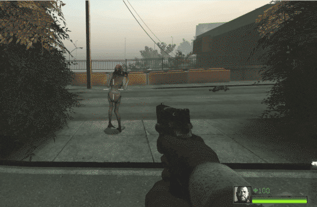

# Description | 內容
Fixed that survivors can bash wandering witch without witch being startled

* Apply to | 適用於
    ```
    L4D2
    ```

* Image | 圖示
    | Before (裝此插件之前)  			| After (裝此插件之後) |
    | -------------|:-----------------:|
    | ||

* <details><summary>How does it work?</summary>

    * (Before) Survivors can bash the wandering witch without witch being startled
        * Go ask valve, I don't know
    * (After) Survivors will startle witch if bash the wandering witch
</details>

* Require | 必要安裝
    1. [actions](https://forums.alliedmods.net/showthread.php?t=321696)
    2. [l4d_change_witch_victim](https://github.com/Target5150/MoYu_Server_Stupid_Plugins/tree/master/The%20Last%20Stand/l4d_change_witch_victim)

* <details><summary>Changelog | 版本日誌</summary>

    * v1.0 (2025-12-31)
        * Initial Release
</details>

- - - -
# 中文說明
修復倖存者推開站立的witch不會導致驚嚇

* 原理
    * (裝此插件之前) 倖存者使用右鍵推開站立的witch，不會導致witch被驚嚇
    * (裝此插件之後) Witch會被驚嚇