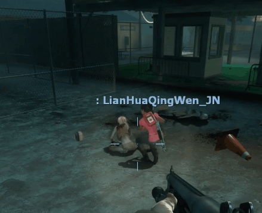

# Description | 內容
The witch turns back if nearby survivor scares her behind

* [Video | 影片展示](https://youtu.be/QGIhKeu9oG8)

* Image | 圖示
    <br/>None

* Image | 圖示
	| Before (裝此插件之前)  			| After (裝此插件之後) |
	| -------------|:-----------------:|
	| ||

* <details><summary>ConVar | 指令</summary>

    None
</details>

* <details><summary>Command | 命令</summary>
    
   None
</details>

* Apply to | 適用於
    ```
    L4D1
    L4D2
    ```

* <details><summary>Related Plugin | 相關插件</summary>

	1. [Witch fixes[Left 4 Fix]](https://forums.alliedmods.net/showthread.php?t=315481): Witch fixes! by Lux
		> 由Lux大老製作修復Witch各種的bug

	2. [witch_target_override](https://github.com/fbef0102/L4D1_2-Plugins/tree/master/witch_target_override): Change target when the witch incapacitates or kills victim + witchs auto follow survivors
		> Witch會自動跟蹤你，一旦驚嚇到她，不殺死任何人絕不罷休

	3. [l4d_witch_stagger_block](https://github.com/fbef0102/Game-Private_Plugin/tree/main/Plugin_%E6%8F%92%E4%BB%B6/Witch_%E5%A5%B3%E5%B7%AB/l4d_witch_stagger_block): Block Witch stumble by Weapons/Shove/Explosive Bullet/Pipebomb/....
		> Witch 不會被狙擊槍/高爆子彈/土製炸彈... 震退
</details>

* <details><summary>Changelog | 版本日誌</summary>

    * v1.3 (2023-9-1)
        * Fix memory leak

    * v1.2
	    * [AlliedModder Post](https://forums.alliedmods.net/showpost.php?p=2770549&postcount=124)
</details>

- - - -
# 中文說明
當有人在背後驚嚇Witch，Witch會秒轉身攻擊

* 原理
    * 在官方預設當中，有人從背後某一個角度驚嚇Witch，會讓Witch卡住 (請看影片展示)
    * 安裝這個插件之後，有人從背後驚嚇Witch，幫Witch自動轉身