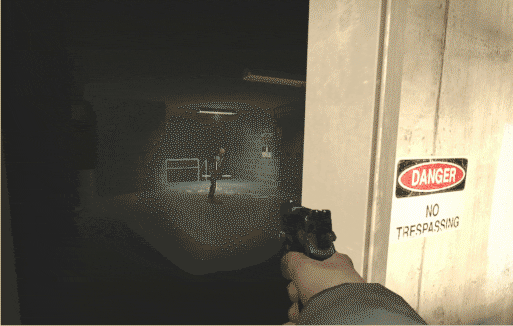
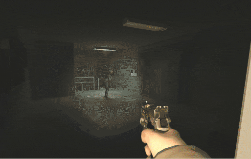

# Description | 內容
Fixing witch can't break the door on Realism mode

* [Video | 影片展示](https://youtu.be/tdbBtFgXzDo)

* Apply to | 適用於
    ```
    L4D2
    ```

* Image | 圖示
    | Before (裝此插件之前)  			| After (裝此插件之後) |
    | -------------|:-----------------:|
    | ||

* <details><summary>How does it work?</summary>

    * (Before) Witch can't break the door on Realism mode
        * Go ask valve, I don't know
    * (After) Fixed
</details>

* Require | 必要安裝
    1. [left4dhooks](https://forums.alliedmods.net/showthread.php?t=321696)

* <details><summary>Changelog | 版本日誌</summary>

    * v1.1 (2025-12-31)
        * Optimize code

    * v1.0 (2023-1-5)
        * Initial Release
</details>

- - - -
# 中文說明
修正Witch在寫實模式下，無法抓破門

* 原理
    * (裝此插件之前) 在官方寫實模式中Witch無法抓破門
    * (裝此插件之後) Witch可以抓破門