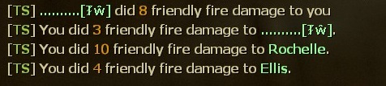
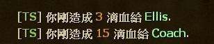

# Description | 內容
Adds Friendly Fire Announcements (who kills teammates)

* Video | 影片展示
<br/>None

* Image
	* Display friendly fire
	<br/>

* Require | 必要安裝
	1. [[INC] Multi Colors](https://github.com/fbef0102/L4D1_2-Plugins/releases/tag/Multi-Colors)

* <details><summary>ConVar | 指令</summary>

	* cfg/sourcemod/l4dffannounce.cfg
        ```php
		// 0=Plugin off, 1=Plugin on.
		l4dffannounce_enable "1"

		// Changes how ff announce displays FF damage (0: Disable, 1:In chat; 2: In Hint Box; 3: In center text)
		l4dffannounce_type "1"
        ```
</details>

* <details><summary>Command | 命令</summary>

	None
</details>

* Apply to | 適用於
    ```
    L4D1
    L4D2
    ```

* <details><summary>Translation Support | 支援翻譯</summary>

	```
	English
	繁體中文
	简体中文
	```
</details>

* <details><summary>Similar Plugin | 相似插件</summary>

	1. [l4d_friendly_fire_stats](https://github.com/fbef0102/Game-Private_Plugin/tree/main/Plugin_%E6%8F%92%E4%BB%B6/Survivor_%E4%BA%BA%E9%A1%9E/l4d_friendly_fire_stats): Display all friendly fire dealt and received
		> 顯示造成與受到的友傷以及兇手，有友傷統計

	2. [anti-friendly_fire](https://github.com/fbef0102/L4D1_2-Plugins/tree/master/anti-friendly_fire): shoot your teammate = shoot yourself
		> 反彈傷害

	3. [anti-friendly_fire_V2](https://github.com/fbef0102/Game-Private_Plugin/tree/main/Plugin_%E6%8F%92%E4%BB%B6/Anti_Griefer_%E9%98%B2%E6%83%A1%E6%84%8F%E8%B7%AF%E4%BA%BA/anti-friendly_fire_V2): shoot teammate = shoot yourself V2
		> 隊友開槍射你會反彈傷害，第二版本
		
	4. [anti-friendly_fire_RPG](https://github.com/fbef0102/Game-Private_Plugin/tree/main/Plugin_%E6%8F%92%E4%BB%B6/Anti_Griefer_%E9%98%B2%E6%83%A1%E6%84%8F%E8%B7%AF%E4%BA%BA/anti-friendly_fire_RPG): shoot teammate = shoot yourself RPG
		> 隊友開槍射你會反彈傷害，RPG版本
</details>

* <details><summary>Changelog | 版本日誌</summary>

	* v1.8 (2022-12-6)
		* Translation Support

	* v1.7
		* Remake Code

    * 1.4 
        * [Original Plugin by Frus](https://forums.alliedmods.net/showthread.php?p=902507)
</details>

- - - -
# 中文說明
顯示誰他馬TK我

* 圖示
	* 造成與受到的友傷
	<br/>

* 原理
	* 受到友傷自動顯示訊息
    * 打到隊友自動顯示訊息

* 功能
	* 指令控制開關
    * 可設定如何顯示提示