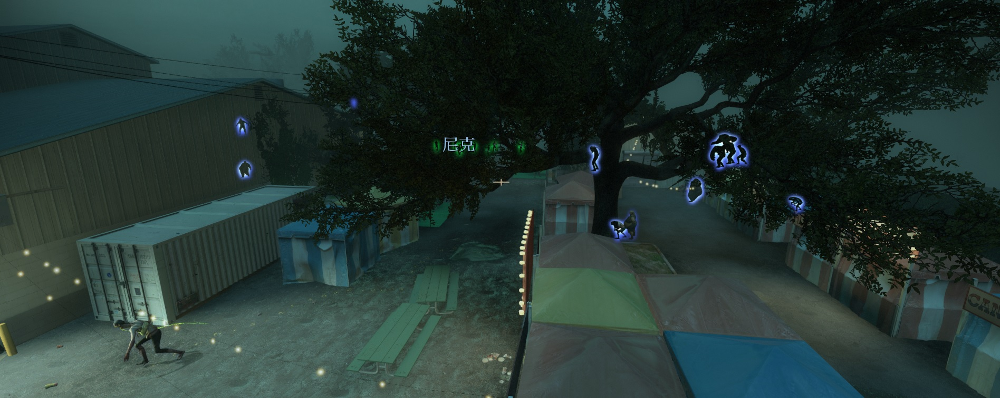
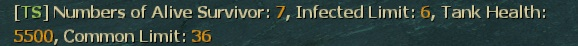
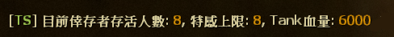
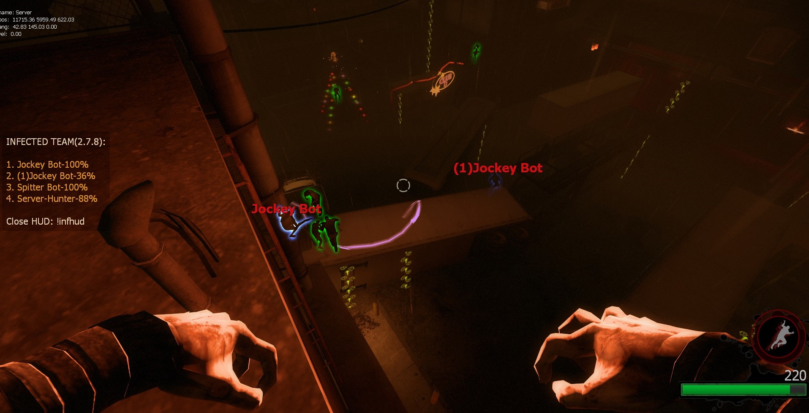
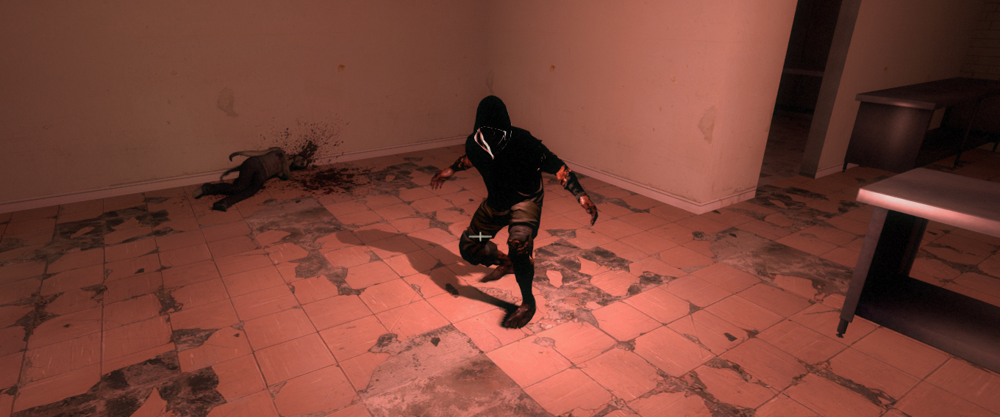
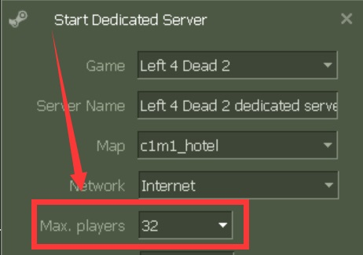
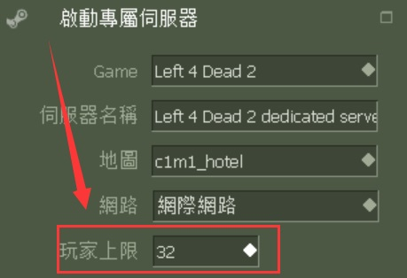

# Description | 內容
Spawns multi infected bots in any mode + allows playable special infected in coop/survival + unlock infected slots (10 VS 10 available)

* Image | 圖示
	* Spawn infected bots without limit (突破限制生成特感)
	<br/>
	<br/>
	<br/>
	* Join infected team and play in coop/survival/realism mode. (在戰役/寫實/生存模式下加入特感陣營)
	<br/>

* Apply to | 適用於
	```
	L4D1 coop/versus/survival
	L4D2 coop/versus/realism/survival/scavenge + all mutation modes
	```

* Require | 必要安裝
	1. [left4dhooks](https://forums.alliedmods.net/showthread.php?t=321696)
	2. [[INC] Multi Colors](https://github.com/fbef0102/L4D1_2-Plugins/releases/tag/Multi-Colors)

* <details><summary>Recommand Install | 推薦安裝</summary>

	1. [SIPool](https://forums.alliedmods.net/showthread.php?t=349615): A Client Pool for SI Bots, used to avoid lots of CreateFakeClient() operation
		* 插件适用于有需要大量且频繁的特感刷新玩法的服务器，主要目的是提升服务器性能
	2. [zombie_spawn_fix](https://forums.alliedmods.net/showthread.php?t=333351): Aim to improve performance when spawn SI
		* 修正某些時候遊戲導演刻意停止特感生成的問題 (非100%完整解決特感不生成的問題)
	3. [l4d_unrestrict_panic_battlefield](https://forums.alliedmods.net/showpost.php?p=2815688&postcount=1024): Removed special infected and common inected only spawn in nav area with "BATTLEFIELD" flag during panic event
		* 移除遊戲中開機關後殭屍與特感都只限制生在"BATTLEFIELD"的nav區域上
</details>

* How to set the correct settings in data config ?
	1. <details><summary>Write Data Config</summary>

		* All settings are in [data/l4dinfectedbots](data/l4dinfectedbots) folder
			* Please Read: [data/l4dinfectedbots/readme_說明書.txt](data/l4dinfectedbots/readme_說明書.txt)
			* Run coop mode => plugin reads ```coop.cfg```
			* Run versus mode => plugin reads```versus.cfg```
			* Run survival mode => plugin reads```survival.cfg```
			* Run scavenge mode => plugin reads```scavenge.cfg```
			* Run realism mode => plugin reads```realism.cfg```
			* Run mutation gamemode => plugin reads```xxxx.cfg``` (```xxxx``` = mutation name)
	</details>

	2. <details><summary>Adjust special infected limit</summary>

		The 6 infected limit [Smoker, Boomer, Hunter, Spitter, Jockey, Charger] combined together must equal or exceed ```max_specials```
		* For example
			```php
			// Good
			"smoker_limit"      "2"
			"boomer_limit"      "2"
			"hunter_limit"      "2"
			"spitter_limit"     "2"
			"jockey_limit"      "2"
			"charger_limit"     "2"
			"max_specials"      "4"
			```

			```php
			// Also Good
			"smoker_limit"      "3"
			"boomer_limit"      "2"
			"hunter_limit"      "3"
			"spitter_limit"     "1"
			"jockey_limit"      "3"
			"charger_limit"     "2"
			"max_specials"      "10"
			```

			```php
			// Bad
			"smoker_limit"      "0"
			"boomer_limit"      "1"
			"hunter_limit"      "2"
			"spitter_limit"     "0"
			"jockey_limit"      "1"
			"charger_limit"     "0"
			"max_specials"      "9"
			```

		> __Note__ 
		<br/>1. Max Special Limit does not count witch, but it counts tank in all gamemode.
		<br/>2. In Versus/Scavenge, Max Special Limit = infected team slots

		> __Warning__ 
		<br/>🟥Infected limit + numbers of survivor + spectators can not exceed 32 slots, otherwise server fails to spawn infected and becomes super lag
	</details>

	3. <details><summary>Adjust special infected spawn time</summary>

		* AI Infected spawn time
			```php
			// Sets the max and min spawn time for special infected spawned by the plugin in seconds.
			"spawn_time_max"  "60.0"
			"spawn_time_min"  "40.0"

			// Amount of seconds before a special infected bot is kicked
			"life"                  "30.0"
			```

		* Human Infected spawn time in versus/scavenge mode
			* Human infected spawn time controlled by the official cvars
				```php
				sm_cvar z_ghost_delay_min "20"
				sm_cvar z_ghost_delay_max "30"
				```

			* Also controlled by "human infected count" and "infected team slot"，here is formula
				```php
				// In L4D2, if there are more than 4 human infected players，"human infected count" = 4
				// In L4D2, if infected team slot is above 4，"infected team slot" = 4
				Minimum spawn time: z_ghost_delay_min * (human infected count ÷ infected team slot)
				Maximum spawn time: z_ghost_delay_max * (human infected count ÷ infected team slot)
				```

			* For example
				```php
				// human infected count：3，infected team slot：4，z_ghost_delay_min: 30，z_ghost_delay_max: 40
				In L4D2, Human infected player spawn time is: [Minimum: 30 * (3÷4) = 22.5s, Maximum: 40 * (3÷4) = 30s]
				In L4D1, Human infected player spawn time is: [Minimum: 30 * (3÷4) = 22.5s, Maximum: 40 * (3÷4) = 30s]

				// human infected count：1，infected team slot：1，z_ghost_delay_min: 3，z_ghost_delay_max: 3
				In L4D2, Human infected player spawn time is: 3 * (1÷1) = 3s
				In L4D1, Human infected player spawn time is: 3 * (1÷1) = 3s

				// human infected count：2，infected team slot：4，z_ghost_delay_min: 18，z_ghost_delay_max: 18
				In L4D2, Human infected player spawn time is: 18 * (2÷4) = 9s
				In L4D1, Human infected player spawn time is: 18 * (2÷4) = 9s

				// human infected count：3，infected team slot：8，z_ghost_delay_min: 20，z_ghost_delay_max: 20
				In L4D2, Human infected player spawn time is: 20 * (3÷4) = 15s
				In L4D1, Human infected player spawn time is: 20 * (2÷8) = 5s

				// human infected count：4，infected team slot：8，z_ghost_delay_min: 20，z_ghost_delay_max: 20
				In L4D2, Human infected player spawn time is: 20 * (4÷4) = 20s
				In L4D1, Human infected player spawn time is: 20 * (4÷8) = 10s

				// human infected count：7，infected team slot：8，z_ghost_delay_min: 20，z_ghost_delay_max: 20
				In L4D2, Human infected player spawn time is: 20 * (4÷4) = 20s
				In L4D1, Human infected player spawn time is: 20 * (7÷8) = 17.5s
				```
	</details>

	4. <details><summary>Adjust Tank limit</summary>

		```php
		// Sets the tank limit (Does not affect director tank)
		"tank_limit"        "1"

		// When each time spawn S.I., how much percent of chance to spawn tank [0-100%]
		"tank_spawn_probability"    "5"

		// 1 = Still spawn tank in final stage rescue (does not affect director tanks)
		"tank_spawn_final"    "0"
		```
	</details>

	5. <details><summary>Adjust SI/Tank health</summary>

		```php
		// Set SI Health (0=Don't modify SI health)
		"smoker_health"      "250"
		"boomer_health"      "50"
		"hunter_health"      "250"
		"spitter_health"     "100"
		"jockey_health"      "325"
		"charger_health"     "600"

		// Sets Health for Tank (0=Don't modify tank health)
		"tank_health"         "4000"
		```
	</details>

	6. <details><summary>Play infected team in coop/survival/realism</summary>

		```php
		// 1 = players can join the infected team in coop/survival/realism
		// !ji in chat to join infected, !js to join survivors
		// Enable this also allow game to continue with survivor bots
		"coop_versus_enable"    "1"

		// Sets the max and min spawn time for human infected player in coop/survival/realism
		"coop_versus_spawn_time_max"    "35.0"
		"coop_versus_spawn_time_min"    "25.0"

		// 1 = Tank will always be controlled by human player in coop/survival/realism.
		"coop_versus_tank_playable" "0"

		// 1 = Clients will be announced to on how to join the infected team in chatbox
		"coop_versus_announce"      "1"

		// Sets the limit for the amount of humans that can join the infected team in coop/survival/realism.
		"coop_versus_human_limit"   "1"

		// Players with these flags have access to join infected team in coop/survival/realism. (Empty = Everyone, -1: Nobody)
		"coop_versus_join_access"   "z"
		```
	</details>

	7. <details><summary>Spawn range (Coop/Realism only)</summary>

		```php
		// The minimum of spawn range for infected. (default: 550, coop/realism only)
		// Override official convar "z_spawn_safety_range", it also affects common zombie spawn range
		"spawn_range_min"   "350"
		```

		* Make infected player spawn near very close by survivors for better gaming experience
			```php
			"spawn_range_min"   "0"
			```
	</details>

	8. <details><summary>Spawn Infected together</summary>

		```php
		// 1 = Bots will only spawn when all other bot spawn timers are at zero.
		"coordination"   "1"

		// 1 = Plugin will disable spawning infected bot when a tank is on the field. (does not affect human infected player in versus)
		"tank_disable_spawn"  "0"
		```
	</details>

	9. <details><summary>Set Weight of Special Infected</summary>

		* Increase chance to spawn specific special infected, For example
			```php
			// Most of time, spawn hunter and charger on the field
			// If hunter limit reached and charger limit reached, spawn other infected
			"smoker_weight"      "5"
			"boomer_weight"      "5"
			"hunter_weight"      "100"
			"spitter_weight"     "8"
			"jockey_weight"      "10"
			"charger_weight"     "90"
			```

		* Scale spawn weights with the limits of corresponding SI
			```php
			// 1 = Scale spawn weights with the limits of corresponding SI
			"scale_weights"     "1"
			```
	</details>

	10. <details><summary>Adjust Witch limit and spawn time</summary>

		```php
		// Sets the limit for witches spawned by the plugin (does not affect director witches)
		"witch_max_limit"        "4"

		// Sets the max and min spawn time for witch
		"witch_spawn_time_max"    "120.0"
		"witch_spawn_time_max"    "90.0"

		// Amount of seconds before a witch is kicked. (only remove witches spawned by this plugin)
		"witch_life"        "200.0"

		// 1 = Still spawn witch in final stage rescue
		"witch_spawn_final"    "0"
		```
	</details>

* Q&A
	1. <details><summary>How to disable this message?</summary>

		
		```php
		// 1 = Announce current plugin status in chatbox when the number of alive survivors changes.
		"announce_enable" "0"
		```
	</details>

	2. <details><summary>How to turn off flashlights on human infected player in coop/survival/realism ?</summary>

		
		```php
		// 1 = Attaches red flash light to human infected player in coop/survival/realism. (Make it clear which infected bot is controlled by player)
		"coop_versus_human_light"   "0"
		```
	</details>

	3. <details><summary>Couldn't find XXXX Spawn position in 5 tries</summary>

		Special Infected can't spawn sometimes, and server console spamming message
		
		* Reason: It means that the game can not find a position to spawn special infected, usually happen when director stops spawning special infected (C1m4 before evelator) or NAV problem (can't find any valid nav area to spawn infected near survivors)

		* 🟥Infected limit + numbers of survivor + spectators can not exceed 31 slots, otherwise server fails to spawn S.I.
		* I can't do anything about the nav pathfinding, only Valve or map authors can handle nav problem.
		* Recommand to install [zombie_spawn_fix](https://forums.alliedmods.net/showthread.php?t=333351) and [l4d_unrestrict_panic_battlefield](https://forums.alliedmods.net/showpost.php?p=2815688&postcount=1024)
	</details>

	4. <details><summary>Count players including dead</summary>

		* Adjust special limit, tank health, zombie common, Tank limit based on numbers of alive and dead survivors
			```php
			// If 1, including dead players when count the number of survivors.
			l4d_infectedbots_calculate_including_dead "1"
			```
	</details>

	5. <details><summary>Disable infected bots spawning on the field.</summary>

		```php
		// 1 = Disable infected bots spawning. Only allow human infected players to spawn (does not disable witch spawn and not affect director spawn)
		"spawn_disable_bots"  "1"
	</details>

	6. <details><summary>Only 18 infected bots can spawn in server?</summary>

		* By default, l4d server max player slots is 18. Go install [l4dtoolz](https://github.com/fbef0102/Game-Private_Plugin/tree/main/Tutorial_%E6%95%99%E5%AD%B8%E5%8D%80/English/Server/Install_Other_File#l4dtoolz) and set Max players=31
		<br/>
		* Max. players only up 31 limit (Can't increase more)
	</details>

* <details><summary>Known Issue</summary>

	1. In coop/realism mode, the infected/spectator players' screen would be stuck and frozen when they are watching survivor deathfall or final rescue mission failed
		> Install [l4d_fix_deathfall_cam](https://github.com/Target5150/MoYu_Server_Stupid_Plugins/tree/master/The%20Last%20Stand/l4d_fix_deathfall_cam) to fix camera stuck
	
	2. In coop/realism mode, the infected player plays as second tank on final chapter, the rescue vehicle show up immediately
		> Install [l4d2_scripted_tank_stage_fix](https://github.com/Target5150/MoYu_Server_Stupid_Plugins/tree/master/The%20Last%20Stand/l4d2_scripted_tank_stage_fix) to fix
</details>

* <details><summary>ConVar | 指令</summary>

	* cfg/sourcemod/l4dinfectedbots.cfg
		```php
		// 0=Plugin off, 1=Plugin on.
		l4d_infectedbots_allow "1"

		// Turn on the plugin in these game modes, separate by commas (no spaces). (Empty = all).
		l4d_infectedbots_modes ""

		// Turn off the plugin in these game modes, separate by commas (no spaces). (Empty = none).
		l4d_infectedbots_modes_off ""

		// Turn on the plugin in these game modes. 0=All, 1=Coop/Realism, 2=Survival, 4=Versus, 8=Scavenge. Add numbers together.
		l4d_infectedbots_modes_tog "0"

		// Toggle whether Infected HUD is active or not.
		l4d_infectedbots_infhud_enable "1"

		// Toggle whether Infected HUD announces itself to clients.
		l4d_infectedbots_infhud_announce "1"

		// If 1, The plugin will force all players to the infected side against the survivor AI for every round and map in versus/scavenge.
		// Enable this also allow game to continue with survivor bots
		l4d_infectedbots_versus_coop "0"

		// Disable sm_zss command in these gamemode (0: None, 1: coop/realism, 2: versus/scavenge, 4: survival, add numbers together)
		l4d_infectedbots_sm_zss_disable_gamemode "6"

		// If 1, including dead players when count the number of survivors.
		l4d_infectedbots_calculate_including_dead "0"

		// Which xxxx.cfg file should this plugin read for settings in data/l4dinfectedbots folder (Ex: "custom_tanks" = reads 'data/l4dinfectedbots/custom_tanks.cfg')
		// Empty=By default, reads data/l4dinfectedbots/xxxx.cfg (xxxx = gamemode or mutation name).
		l4d_infectedbots_read_data ""
		```
</details>

* <details><summary>Command | 命令</summary>
	
	* **(Coop/Realism/Survival only) Join Infected**
		```php
		sm_ji
		```

	* **(Coop/Realism/Survival only) Join Survivors**
		```php
		sm_js
		```

	* **(Infected only) Toggle HUD on/off for themselves**
		```php
		sm_infhud
		```

	* **(Infected only) Suicide myself (if get stuck or out of map)**
		```php
		sm_zss
		```

	* **Control special zombies spawn timer until next map or data is reloaded (Adm Required: ADMFLAG_ROOT)**
		```php
		sm_timer
		```

	* **Control max special zombies limit until next map or data is reloaded (Adm Required: ADMFLAG_ROOT)**
		```php
		sm_zlimit
		```
</details>

* <details><summary>Translation Support | 支援翻譯</summary>

	```
	English
	繁體中文
	简体中文
	Russian
	```
</details>

* <details><summary>Related Plugin | 相關插件</summary>

	1. [MultiSlots](/l4dmultislots): Allows additional survivor players in server when 5+ player joins the server
		> 創造5位以上倖存者遊玩伺服器
	2. [AI_HardSI](/AI_HardSI): Improves the AI behaviour of special infected
		> 強化每個AI 特感的行為與提高智商，積極攻擊倖存者
	3. [l4d_ssi_teleport_fix](https://github.com/fbef0102/Game-Private_Plugin/tree/main/L4D_插件/Special_Infected_%E7%89%B9%E6%84%9F/l4d_ssi_teleport_fix): Teleport AI Infected player (Not Tank) to the teammate who is much nearer to survivors.
		> 傳送比較遠的AI特感到靠近倖存者的特感隊友附近
	4. [l4d_infected_limit_control](https://github.com/fbef0102/Game-Private_Plugin/tree/main/L4D_插件/Common_Infected_%E6%99%AE%E9%80%9A%E6%84%9F%E6%9F%93%E8%80%85/l4d_infected_limit_control): Adjust common infecteds/hordes/mobs depends on 5+ survivors and map
		> 根據玩家人數多寡與地圖，設定普通殭屍與屍潮的數量限制
	5. [gamemode-based_configs](/gamemode-based_configs): Allows for custom settings for each gamemode and mutatuion.
		> 根據遊戲模式或突變模式執行不同的cfg文件
</details>

* <details><summary>Changelog | 版本日誌</summary>

	* v3.0.2 (2025-1-29)
		* If root admin use !zlimit or !timer to change zombies limit/spawn timer, keep the change until next map or data is reloaded
		* Remove common limit

	* v3.0.1 (2025-1-18)
		* Support SIPool

	* v3.0.0 (2025-1-7)
		* Fixed SI bots still spawn when tank is on the field in l4d1

	* v2.9.9 (2024-11-8)
		* Fixed ghost tank bug in non-versus mode if real player in infected team
		* Fixed double tank bug in non-versus mode if real player in infected team

	* v2.9.8 (2024-9-14)
		* Fixed real SI player can't see the ladder in coop/realism

	* v2.9.7 (2024-8-8)
		* Fixed Special Infected Health

	* v2.9.6 (2024-5-1)
		* Fixed Enable/Disable cvar

	* v2.9.5 (2024-4-13)
		* Fixed Crash when real player playing infected team in coop/realism/survival

	* v2.9.4 (2024-3-25)
		* Update Data Config
		* Add smoker, boomer, hunter, spitter, jockey, charger health in data

	* v2.9.3 (2024-2-23)
		* You can choose to load different data config instead of xxxx.cfg (xxxx = gamemode or mutation name) in data/l4dinfectedbots folder
		* pdate Data Config
		* Update Translation
		* Update Cvars

	* v2.9.2 (2024-2-18)
		* Update Translation
		* Update Commands

	* v2.9.1 (2024-2-14)
		* Prevent players from joining infected team and occupy slots forever in coop/survival/realism
		* Update Data
		* Update Translation
		
	* v2.9.0 (2024-2-9)
		* Change another method to spawn human infected in coop/realism/survival instead of FakeClientCommand
		* Add Data config to control spawn timers, spawn limit, tank limit, witch limit, common infected limit.....
		* Update Cvars
		* Update Commands

	* v2.8.9 (2024-1-27)
		* Updated L4D1 Gamedata 

	* v2.8.8 (2023-12-2)
		* Infected limit + numbers of survivor + spectators can not exceed 32 slots, otherwise server fails to spawn infected and becomes super lag

	* v2.8.7 (2023-10-9)
		* Fixed the code to avoid calling L4D_SetPlayerSpawnTim native from L4D1. (This Native is only supported in L4D2.)

	* v2.8.6 (2023-9-22)
		* Fixed "l4d_infectedbots_coordination" not working
		* Fixed Bot Spawn timer
		
	* v2.8.5 (2023-9-17)
		* Adjust human spawn timer when 5+ infected slots in versus/scavenge
		* In Versus/Scavenge, human infected spawn timer controlled by the official cvars "z_ghost_delay_min" and "z_ghost_delay_max" 

	* v2.8.4 (2023-8-26)
		* Improve Code.

	* v2.8.3 (2023-7-5)
		* Override L4D2 Vscripts to control infected limit.

	* v2.8.2 (2023-5-27)
		* Add a cvar, including dead survivors or not
		* Add a cvar, disable infected bots spawning or not in versus/scavenge mode

	* v2.8.1 (2023-5-22)
		* Support l4d2 all mutation mode.

	* v2.8.0 (2023-5-5)
		* Add Special Infected Weight
		* Add and modify cvars about Special Infected Weight

	* v2.7.9 (2023-4-13)
		* Fixed Not Working in Survival Mode
		* Fixed cvar "l4d_infectedbots_adjust_spawn_times" calculation mistake

	* v2.7.8 (2023-2-20)
		* [AlliedModder Post](https://forums.alliedmods.net/showpost.php?p=2699220&postcount=1369)
		* ProdigySim's method for indirectly getting signatures added, created the whole code for indirectly getting signatures so the plugin can now withstand most updates to L4D2! (Thanks to [Shadowysn](https://forums.alliedmods.net/showthread.php?t=320849) and [ProdigySim](https://github.com/ProdigySim/DirectInfectedSpawn)
		* L4D1 Signature update. Credit to [Psykotikism](https://github.com/Psykotikism/L4D1-2_Signatures).
		* Remake Code
		* Add translation support.
		* Update L4D2 "The Last Stand" gamedata, credit to [Lux](https://forums.alliedmods.net/showthread.php?p=2714236), [Shadowysn](https://forums.alliedmods.net/showthread.php?t=320849) and [Machine](https://forums.alliedmods.net/member.php?u=74752)
		* Spawn infected without being limited by the director.
		* Join infected team in coop/survival/realism mode.
		* Light up SI ladders in coop/realism/survival. mode for human infected players. (l4d2 only, didn't work if you host a listen server)
		* Add cvars to turn off this plugin.
		* Fixed Hunter Tank Bug in l4d1 coop mode when tank is playable.
		* If you want to fix Camera stuck in coop/versus/realism, install [this plugin by Forgetest](https://github.com/Target5150/MoYu_Server_Stupid_Plugins/tree/master/The%20Last%20Stand/l4d_fix_deathfall_cam)
		* Fixed Music Bugs when switching to infected team in coop/realism/survival.

	* v1.0.0
		* [Original Plugin By mi123645](https://forums.alliedmods.net/showthread.php?t=99746)
</details>

- - - -
# 中文說明
多特感生成插件，倖存者人數越多，生成的特感越多，且不受遊戲特感數量限制 + 解除特感隊伍的人數限制 (可達成對抗 10 VS 10 玩法)

* 原理
	* 此插件控制遊戲導演生成系統，能夠強制無視遊戲特感數量限制，生成多特感
	* 當倖存者變多時，殭屍數量變多、特感數量變多、Tank數量變多、Tank血量變多，提升遊戲難度
	* 此插件可以讓玩家在戰役/寫實/生存模式下加入特感陣營，用來惡搞戰役玩家XD
	* 解鎖特感隊伍的人數上限，可以加入第五位以上的特感真人玩家，達成對抗 10 VS 10 玩法
	* **支援所有模式包括突變模式**

* 如何設置文件正確的數值?
	1. <details><summary>文件設定範例</summary>

		* 所有功能設置都在 [data/l4dinfectedbots](data/l4dinfectedbots) 資料夾裡
			* 中文說明書: [data/l4dinfectedbots/readme_說明書.txt](data/l4dinfectedbots/readme_說明書.txt)
			* 當前模式是戰役 => 插件讀取```coop.cfg```
			* 當前模式是對抗 => 插件讀取```versus.cfg```
			* 當前模式是生存 => 插件讀取```survival.cfg```
			* 當前模式是清道夫 => 插件讀取```scavenge.cfg```
			* 當前模式是寫實 => 插件讀取```realism.cfg```
			* 其他模式 => 插件讀取```xxxx.cfg``` (```xxxx``` = 遊戲模式名稱或突變模式名稱)
	</details>

	2. <details><summary>設置特感生成數量上限</summary>

		必須讓6個特感數量[Smoker, Boomer, Hunter, Spitter, Jockey, Charger]的值加起來超過```"max_specials"```
		* For example
			```php
			// 好
			"smoker_limit"      "2"
			"boomer_limit"      "2"
			"hunter_limit"      "2"
			"spitter_limit"     "2"
			"jockey_limit"      "2"
			"charger_limit"     "2"
			"max_specials"      "4"
			```

			```php
			// 沒問題
			"smoker_limit"      "3"
			"boomer_limit"      "2"
			"hunter_limit"      "3"
			"spitter_limit"     "1"
			"jockey_limit"      "3"
			"charger_limit"     "2"
			"max_specials"      "10"
			```

			```php
			// 爛，六隻特感上限的總和未超過"max_specials" 
			"smoker_limit"      "0"
			"boomer_limit"      "1"
			"hunter_limit"      "2"
			"spitter_limit"     "0"
			"jockey_limit"      "1"
			"charger_limit"     "0"
			"max_specials"      "9"
			```

		> __Note__ 
		<br/>1. 請注意，最大數量限制不包含witch的數量，但會包含tank的數量
		<br/>2. 在對抗／清道夫模式中，特感最大生成數量 = 特感隊伍的空位
		
		> __Warning__ 
		<br/>🟥警告!!! 特感數量 + 倖存者數量 + 旁觀者數量不得超過32，否則伺服器會變得很卡且無法生成特感 (因為此遊戲只能容納32個)
	</details>

	3. <details><summary>調整特感生成時間</summary>

		* AI 特感復活時間
			```php
			// 設置插件生成的特感最大與最小時間 (秒)
			"spawn_time_max"  "60.0"
			"spawn_time_min"  "40.0"

			// AI特感生成多少秒後，如果沒攻擊倖存者也沒被看見將踢出遊戲（防止AI卡住）
			"life"                  "30.0"
			```

		* (對抗/清道夫) 真人特感玩家的復活時間
			* 真人玩家的復活時間是根據官方指令設定
				```php
				sm_cvar z_ghost_delay_min "20"
				sm_cvar z_ghost_delay_max "30"
				```

			* 也依照"特感玩家數量"與"特感隊伍空位"自動做出最終調整，其公式為
				```php
				// 在L4D2，如果"特感玩家數量" 大於等於4，則以4代入計算
				// 在L4D2，如果"特感隊伍空位" 大於等於4，則以4代入計算
				最短時間: z_ghost_delay_min * (特感玩家數量 ÷ 特感隊伍空位) 
				最長時間: z_ghost_delay_max * (特感玩家數量 ÷ 特感隊伍空位)
				```

			* 以下舉例
				```php
				// 特感玩家：3人，特感隊伍空位：4人，z_ghost_delay_min: 30，z_ghost_delay_max: 40
				在L4D2，特感玩家復活時間最終為: [最短時間: 30 * (3÷4) = 22.5秒, 最長時間: 40 * (3÷4) = 30秒]
				在L4D1，特感玩家復活時間最終為: [最短時間: 30 * (3÷4) = 22.5秒, 最長時間: 40 * (3÷4) = 30秒]

				// 特感玩家：1人，特感隊伍空位：1人，z_ghost_delay_min: 3，z_ghost_delay_max: 3
				在L4D2，特感玩家復活時間最終為: 3 * (1÷1) = 3秒
				在L4D1，特感玩家復活時間最終為: 3 * (1÷1) = 3秒

				// 特感玩家：2人，特感隊伍空位：4人，z_ghost_delay_min: 18，z_ghost_delay_max: 18
				在L4D2，特感玩家復活時間最終為: 18 * (2÷4) = 9秒
				在L4D1，特感玩家復活時間最終為: 18 * (2÷4) = 9秒

				// 特感玩家：3人，特感隊伍空位：8人，z_ghost_delay_min: 20，z_ghost_delay_max: 20
				在L4D2，特感玩家復活時間最終為: 20 * (3÷4) = 15秒
				在L4D1，特感玩家復活時間最終為: 20 * (2÷8) = 5秒

				// 特感玩家：4人，特感隊伍空位：8人，z_ghost_delay_min: 20，z_ghost_delay_max: 20
				在L4D2，特感玩家復活時間最終為: 20 * (4÷4) = 20秒
				在L4D1，特感玩家復活時間最終為: 20 * (4÷8) = 10秒

				// 特感玩家：7人，特感隊伍空位：8人，z_ghost_delay_min: 20，z_ghost_delay_max: 20
				在L4D2，特感玩家復活時間最終為: 20 * (4÷4) = 20秒
				在L4D1，特感玩家復活時間最終為: 20 * (7÷8) = 17.5秒
				```
	</details>

	4. <details><summary>調整Tank生成數量上限</summary>

		```php
		// 設置Tank上限 (不影響導演系統生成tank)
		"tank_limit"        "1"

		// 每次生成一個特感的時候多少概率會變成tank [0-100%]
		"tank_spawn_probability"    "5"

		// 1 = 最後一關救援後插件持續生成Tank（不影響導演系統生成的Tank）
		"tank_spawn_final"    "0"
		```
	</details>

	5. <details><summary>調整特感與Tank血量</summary>

		```php
		// 設置特感血量 (0=不修改血量)
		"smoker_health"      "250"
		"boomer_health"      "50"
		"hunter_health"      "250"
		"spitter_health"     "100"
		"jockey_health"      "325"
		"charger_health"     "600"

		// 設置Tank血量 (0=不修改血量)
		"tank_health"         "4000"
		```
	</details>

	6. <details><summary>在戰役/倖存者/寫實模式下成為感染者</summary>

		```php
		// 1 = 玩家可以在戰役/寫實/生存模式中加入感染者 (!ji加入感染者，!js加入倖存者)"
		// 開啟此指令，即使倖存者陣營都是Bot，會強制遊戲繼續進行
		"coop_versus_enable"    "1"

		// 插件生成真人特感玩家的最大與最小時間 (秒) (戰役/寫實/生存模式)
		"coop_versus_spawn_time_max"    "35.0"
		"coop_versus_spawn_time_min"    "25.0"

		// 1 = 玩家可以在戰役/寫實/生存模式中接管Tank
		"coop_versus_tank_playable" "0"

		// 1 = 在聊天框提示玩家如何加入到倖存者和感染者
		"coop_versus_announce"      "1"

		// 在戰役/倖存者/清道夫中設置通過插件加入到感染者的玩家數量
		"coop_versus_human_limit"   "1"

		// 擁有這些權限的玩家在戰役/寫實/生存模式中可以加入到感染者 (留白 = 所有人可以加入, -1: 所有人無法加入)
		"coop_versus_join_access"   "z"
		```
	</details>

	7. <details><summary>特感生成距離 (僅限戰役/寫實)</summary>

		```php
		// 特感生成的最小距離 (默認: 550, 僅戰役/寫實)
		// 覆蓋官方指令 "z_spawn_safety_range, 這個設置也會影響普通殭屍的生成範圍和真人特感玩家的靈魂狀態復活距離
		"spawn_range_min"   "350"
		```

		* 讓特感可以在非常接近幸存者的地方復活，以獲得更好的遊戲體驗。
			```php
			"spawn_range_min"   "0"
			```
	</details>

	8. <details><summary>一次性生成全部特感</summary>

		```php
		// 1 = 感染者需要等待其他感染者復活時間到才能一起生成
		"coordination"   "1"

		// 1 = 當Tank存活，插件停止生成特感 (不影響對抗模式的真人特感)
		"tank_disable_spawn"  "0"
		```
	</details>

	9. <details><summary>設置特感的權重</summary>

		* 增減特感的權重, 譬如
			```php
			// 每一次特感生成, 有很大的機率生成Hunter與Charger
			// 如果Hunter與Charger達到最大數量限制, 則根據權重分配生成其他特感
			"smoker_weight"      "5"
			"boomer_weight"      "5"
			"hunter_weight"      "100"
			"spitter_weight"     "8"
			"jockey_weight"      "10"
			"charger_weight"     "90"
			```

		* 可根據"場上特感數量"與"生成最大數量"兩種值調整每個特感的權重 (~~公式如何計算，不要問~~)
			```php
			// 如果爲1，可生成的最大數量越多，該特感的權重值越高
			// 如果爲1，場上相同特感種類的數量越多，該特感的權重值越低
			scale_weights "1"
			```
	</details>

	10. <details><summary>調整Witch生成數量與生成時間</summary>

		```php
		// 插件可生成witch的最大數量 （不影響導演生成的witch）
		"witch_max_limit"        "4"

		// 插件生成witch的最大與最小時間 (秒)
		"witch_spawn_time_max"    "120.0"
		"witch_spawn_time_max"    "90.0"

		// witch生成多少秒才會踢出（不影響導演生成的witch）
		"witch_life"        "200.0"

		// 1 = 最後一關救援開始後插件持續生成witch
		"witch_spawn_final"    "0"
		```
	</details>

* Q&A問題
	1. <details><summary>如何關閉這個消息?</summary>

		
		```php
		// 1 = 當存活的倖存者數量發生變化時，聊天框提示插件狀態
		"announce_enable" "0"
		```
	</details>

	2. <details><summary>在戰役/寫實/生存下如何關閉特感真人玩家的紅色光燈?</summary>

		
		```php
		// 1 = 真人扮演的感染者，身體會發出紅色的動態光 (戰役/寫實/生存模式)
		"coop_versus_human_light"   "0"
		```
	</details>

	3. <details><summary>為什麼有些時候不會有特感生成?</summary>

		* 問題：特感無法生成，然後伺服器後台經常冒出```Couldn't find xxxxx Spawn position in X tries```
		

		* 分析：AI特感與普通感染者生成的範圍是受到限制的，在官方的預設當中，是距離人類550~1500公尺範圍之間找位置復活，如果在這範圍內找不到，那就不會有特感與普通感染者。

		* 原因一：地圖故意作者為之，為了怕人類滅團所以停止特感生成一段時間，常發生在三方圖開啟地圖機關的時候或者開啟最終章救援無線電之前
			* 解決方式法一：去跟地圖作者抱怨
			* 解決方式法二：自己修改地圖vscript
			* 解決方式法三：推薦安裝[zombie_spawn_fix](https://forums.alliedmods.net/showthread.php?t=333351)與[l4d_unrestrict_panic_battlefield](https://forums.alliedmods.net/showpost.php?p=2815688&postcount=1024)，修正某些時候遊戲導演刻意停止特感生成的問題 (非100%完整解決特感不生成的問題)
		2. 原因二：地圖問題，找不到附近的地形特感，常發生在NAV沒有做好的爛圖或是人類已經抵達地圖終點，譬如死亡都心第一關人類抵達終點安全室的附近
			* 解決方式法一：去跟地圖作者抱怨
			* 解決方式法二：自己修改地圖的NAV
		3. 原因三：所有能生成特感的地方都被倖存者看見，導致特感找不到位置無法復活，常發生在地圖太寬闊的地形，沒有任何障礙物掩護。
			* 解決方式法一：去跟地圖作者抱怨
			* 解決方式法二：自己修改地圖的NAV
			* 解決方式法三：把特感生成範圍弄大點，修改官方指令
				* 有副作用，會導致特感生成得太遠攻擊不到倖存者，不建議此方法
				```php
				// 預設是1500
				sm_cvar z_spawn_range 2500
				```
			* 解決方式法四：請倖存者隊伍移動位置，讓特感可以生成
		4. 原因四：有設置指令值```director_no_specials 1```，這會關閉遊戲導演系統
			* 解決方式：```sm_cvar director_no_specials 0```
		5. 🟥 特感數量 + 倖存者數量 + 旁觀者數量 超過了31個位子，伺服器會變得很卡且無法生成特感
			* 解決方式：無法解決，請盡量減少特感數量或倖存者數量，因為此遊戲最多只能容納31個 "特感玩家(包括Bot)+倖存者玩家(包括Bot)+旁觀者"
	</details>

	4. <details><summary>計算第5位以上死亡的倖存者</summary>

		* 調整特感最大生成數量、Tank血量、普通殭屍最大數量、tank生成限制時，計算倖存者數量時也包含死亡的玩家
			```php
			// 為1時，計算倖存者數量時也包含死亡的倖存者
			l4d_infectedbots_calculate_including_dead "1"
			```
	</details>

	5. <details><summary>停止特感Bots生成</summary>

		* 在對抗/清道夫模式中，關閉特感bots生成，只允許真人特感玩家生成特感 (此插件會繼續生成Witch、不影響導演系統)
			```php
			// 1 = 關閉特感bots生成，只允許真人特感玩家生成 (此插件會繼續生成Witch、不影響導演系統)
			"spawn_disable_bots"  "1"
			```
	</details>

	6. <details><summary>伺服器好像只能生成18個特感bots?</summary>

		* 因為此遊戲預設人數上限為18. 請去安裝 [l4dtoolz](https://github.com/fbef0102/Game-Private_Plugin/tree/main/Tutorial_%E6%95%99%E5%AD%B8%E5%8D%80/Chinese_%E7%B9%81%E9%AB%94%E4%B8%AD%E6%96%87/Server/%E5%AE%89%E8%A3%9D%E5%85%B6%E4%BB%96%E6%AA%94%E6%A1%88%E6%95%99%E5%AD%B8#%E5%AE%89%E8%A3%9Dl4dtoolz)，務必將"客戶端人數上限"改成31
		<br/>
		* 最高只能到31客戶端人數上限 (在問就自己去當valve員工)
	</details>

* <details><summary>已知問題</summary>

	1. 在戰役/寫實下，特感玩家的視角畫面會卡住，常發生在倖存者滅團重新回合的時候
		> 請安裝[l4d_fix_deathfall_cam](https://github.com/Target5150/MoYu_Server_Stupid_Plugins/tree/master/The%20Last%20Stand/l4d_fix_deathfall_cam)
	
	2. 在戰役/寫實下，特感玩家扮演第二隻救援Tank時，救援載具會直接來臨
		> 請安裝[l4d2_scripted_tank_stage_fix](https://github.com/Target5150/MoYu_Server_Stupid_Plugins/tree/master/The%20Last%20Stand/l4d2_scripted_tank_stage_fix) to fix
</details>

* <details><summary>指令中文介紹 (點我展開)</summary>

		```php
		// 0=關閉插件, 1=開啓插件
		l4d_infectedbots_allow "1"

		// 什麼模式下啟動此插件, 逗號區隔 (無空白). (留白 = 所有模式)
		l4d_infectedbots_modes ""

		// 什麼模式下關閉此插件, 逗號區隔 (無空白). (留白 = 無)
		l4d_infectedbots_modes_off ""

		// 什麼模式下啟動此插件. 0=所有模式, 1=戰役, 2=生存, 4=對抗, 8=清道夫. 請將數字相加起來
		l4d_infectedbots_modes_tog "0"

		// 1=感染者玩家開啓HUD
		l4d_infectedbots_infhud_enable "1"

		// 1=提示感染者玩家如何開啓HUD
		l4d_infectedbots_infhud_announce "1"

		// 如果爲1，則在對抗/清道夫模式中，強迫所有玩家加入到感染者
		// 開啟此指令，即使都是倖存者Bot，會強制遊戲繼續進行
		l4d_infectedbots_versus_coop "0"

		// 在哪些遊戲模式中禁止感染者玩家使用sm_zss自殺 (0: 無, 1: 戰役/寫實, 2: 對抗/清道夫, 4: 生存, 請將數字相加)
		l4d_infectedbots_sm_zss_disable_gamemode "6"

		// 為1，計算倖存者數量時也包含死亡的倖存者
		l4d_infectedbots_calculate_including_dead "0"

		// 自訂此插件位於data/l4dinfectedbots資料夾想要讀取的文件名稱 (譬如: "custom_tanks"，此插件讀取 'data/l4dinfectedbots/custom_tanks.cfg')
		// 留白=插件預設讀取data/l4dinfectedbots/xxxx.cfg (xxxx = 遊戲模式名稱或突變模式名稱).
		l4d_infectedbots_read_data ""
		```
</details>

* <details><summary>命令中文介紹 (點我展開)</summary>
	
	* **(僅限戰役/寫實/倖存者) 加入到感染者陣營**
		```php
		sm_ji
		```

	* **(僅限戰役/寫實/倖存者) 加入到倖存者陣營**
		```php
		sm_js
		```

	* **(僅限感染者玩家) 開關感染者HUD**
		```php
		sm_infhud
		```

	* **(僅限感染者玩家) 感染者玩家自殺 (讓感染者卡住時可以死亡)**
		```php
		sm_zss
		```

	* **設置特感的生成時間，直到關卡結束或是重新載入data (權限: ADMFLAG_ROOT)**
		```php
		sm_timer
		```

	* **設置場上特感的數量上限，直到關卡結束或是重新載入data (權限: ADMFLAG_ROOT)**
		```php
		sm_zlimit
		```
</details>