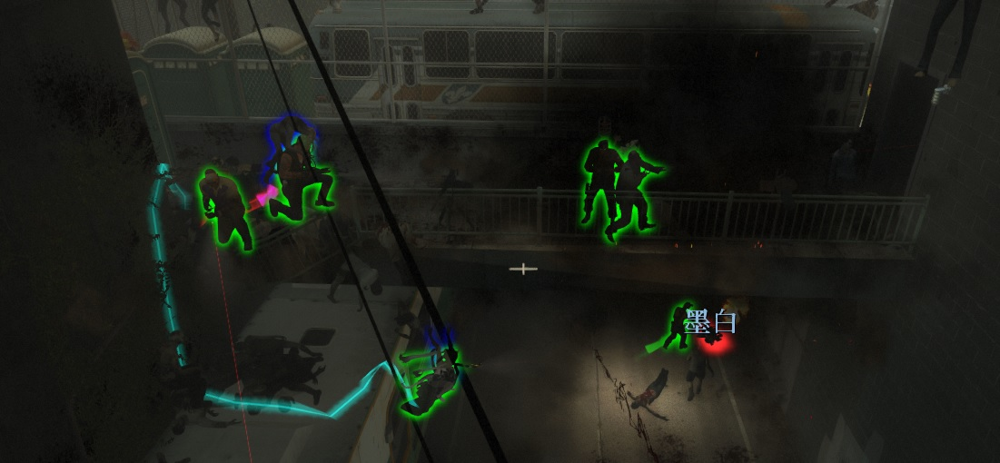
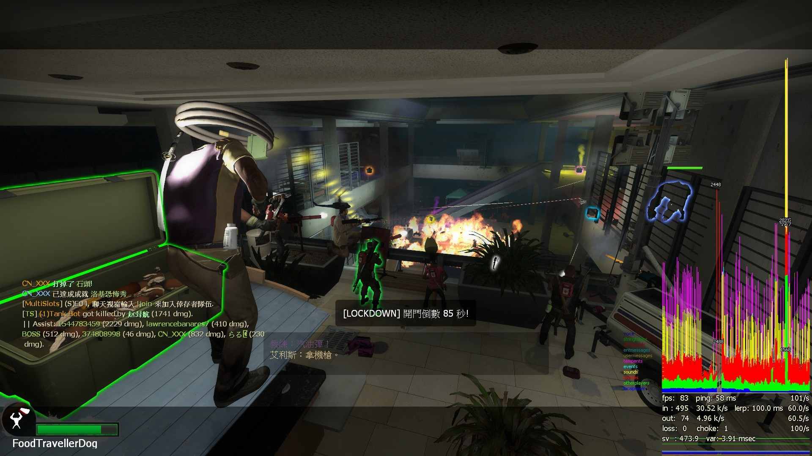

# Description | 內容
Allows additional survivor players in server when 5+ player joins the server
* When 5+ player joins the server but no any bot can be taken over, this plugin will spawn an alive survivor bot for him.

* Video | 影片展示
<br>None

* Image | 圖示
	* 8+ Survivors join server to play (生成5位以上的倖存者大亂鬥)
	<br/>
	<br/>

* Require
	1. [l4dtoolz](https://github.com/fbef0102/Game-Private_Plugin/tree/main/Tutorial_%E6%95%99%E5%AD%B8%E5%8D%80/English/Server/Install_Other_File#l4dtoolz): To unlock more than 18 survivors and server slots limit
	2. [left4dhooks](https://forums.alliedmods.net/showthread.php?t=321696)
	3. [[INC] Multi Colors](https://github.com/fbef0102/L4D1_2-Plugins/releases/tag/Multi-Colors)
	4. [CreateSurvivorBot](https://forums.alliedmods.net/showpost.php?p=2729883&postcount=16)

* <details><summary>ConVar | 指令</summary>

	* cfg/sourcemod/l4dmultislots.cfg
		```php
		// Total survivors allowed on the server. If numbers of survivors reached limit, no any new bots would be created.
		// Must be greater then or equal to 'l4d_multislots_min_survivors'
		l4d_multislots_max_survivors "10"

		// Set minimum # of survivors in game.(Override official cvar 'survivor_limit')
		// Kick AI survivor bots if numbers of survivors has exceeded the certain value. (does not kick real player, minimum is 1)
		l4d_multislots_min_survivors "4"

		// Delete all items form survivor bots when they got kicked by this plugin. (0=off)
		l4d_multislots_bot_items_delete "1"

		// When 5+ new player joins the server but no any bot can be taken over, the player will appear as a dead survivor if survivors have left start safe area for at least X seconds. (0=Always spawn alive bot for new player)
		l4d_multislots_alive_bot_time "0"

		// Setup time interval the instruction message to spectator.(0=off)
		l4d_multislots_spec_message_interval "25"

		// Amount of HP a new 5+ Survivor will spawn with (Def 80)
		l4d_multislots_respawnhp "80"

		// Amount of buffer HP a new 5+ Survivor will spawn with (Def 20)
		l4d_multislots_respawnbuffhp "20"

		// If 1, Spawn 5+ survivor bots when round starts. (Numbers depends on Convar l4d_multislots_min_survivors)
		l4d_multislots_spawn_survivors_roundstart "0"

		// (L4D2) First slot weapon for new 5+ Survivor (1-Autoshot, 2-SPAS, 3-M16, 4-SCAR, 5-AK47, 6-SG552, 7-Mil Sniper, 8-AWP, 9-Scout, 10=Hunt Rif, 11=M60, 12=GL, 13-SMG, 14-Sil SMG, 15=MP5, 16-Pump Shot, 17=Chrome Shot, 18=Rand T1, 19=Rand T2, 20=Rand T3, 0=off)
		// GL = Grenade Launcher
		// Rand T3 = M60 or Grenade Launcher
		l4d_multislots_firstweapon "19"

		// (L4D2) Second slot weapon for new 5+ Survivor (1- Dual Pistol, 2-Magnum, 3-Chainsaw, 4=Melee weapon from map, 5=Random, 0=Only Pistol)
		l4d_multislots_secondweapon "5"

		// (L4D2) Third slot weapon for new 5+ Survivor (1 - Moltov, 2 - Pipe Bomb, 3 - Bile Jar, 4=Random, 0=off)
		l4d_multislots_thirdweapon "4"

		// (L4D2) Fourth slot weapon for new 5+ Survivor (1 - Medkit, 2 - Defib, 3 - Incendiary Pack, 4 - Explosive Pack, 5=Random, 0=off)
		l4d_multislots_forthweapon "0"

		// (L4D2) Fifth slot weapon for new 5+ Survivor (1 - Pills, 2 - Adrenaline, 3=Random, 0=off)
		l4d_multislots_fifthweapon "0"

		// (L4D1) First slot weapon for new 5+ Survivor (1 - Autoshotgun, 2 - M16, 3 - Hunting Rifle, 4 - smg, 5 - shotgun, 6=Random T1, 7=Random T2, 0=off)
		l4d_multislots_firstweapon "6"

		// (L4D1) Second slot weapon for new 5+ Survivor (1 - Dual Pistol, 0=Only Pistol)
		l4d_multislots_secondweapon "1"

		// (L4D1) Third slot weapon for new 5+ Survivor (1 - Moltov, 2 - Pipe Bomb, 3=Random, 0=off)
		l4d_multislots_thirdweapon "3"

		// (L4D1) Fourth slot weapon for new 5+ Survivor (1 - Medkit, 0=off)
		l4d_multislots_forthweapon "0"

		// (L4D1) Fifth slot weapon for new 5+ Survivor (1 - Pills, 0=off)
		l4d_multislots_fifthweapon "0"

		// If 1, allow extra first aid kits for 5+ players when in start saferoom, One extra kit per player above four. (0=No extra kits)
		l4d_multislots_saferoom_extra_first_aid "1"

		// If 1, allow extra first aid kits for 5+ players when the finale is activated, One extra kit per player above four. (0=No extra kits)
		l4d_multislots_finale_extra_first_aid "1"

		// If 1, when same player reconnect the server or rejoin survivor team but no any bot can be taken over, give him a dead bot. (0=Always spawn alive bot for same player)
		// Take effect after survivor has left safe zone
		l4d_multislots_no_second_free_spawn "0"

		// Invincible time after new 5+ Survivor spawn by this plugin. (0=off)
		// Take effect after survivor has left safe zone
		l4d_multislots_respawn_invincibletime "3.0"

		// How to join the game for new player.
		// 0: Old method. Spawn an alive bot first -> new player takes over.
		// 1: Switch new player to survivor team (dead state) -> player respawns.
		l4d_multislots_join_survior_method "0"

		// If 1, Block 'Join Survivors' commands (sm_join, sm_js)
		l4d_multislots_join_command_block "0"

		// If 1, Check team balance when player tries to use 'Join Survivors' command to join survivor team in versus/scavenge.
		// If team is unbanlance, will fail to join survivor team!
		l4d_multislots_versus_command_balance "1"

		// Teams are unbalanced when one team has this many more players than the other team in versus/scavenge.
		l4d_multislots_versus_teams_unbalance_limit "1"
		```
</details>

* <details><summary>Command | 命令</summary>
	
	* **Attempt to join Survivors**
		```php
		sm_join
		sm_js
		```

	* **Attempt to add a survivor bot (this bot will not be kicked by this plugin until someone takes over) (Adm require: ADMFLAG_KICK)**
		```php
		sm_muladdbot
		```
</details>

* <details><summary>Conflicts</summary>

	* DO NOT modify cvar ```survivor_limit``` value in your cfg
	* If you have one of following plugins, please delete
		1. [bebop - additional coop players (20+ players possible)](https://forums.alliedmods.net/showthread.php?t=110210)
		2. [SuperVersus](https://forums.alliedmods.net/showthread.php?p=830069)
		3. [[L4D & L4D2] Bots Control In Coop Mode](https://forums.alliedmods.net/showthread.php?t=175060)
		4. [ABM: A MultiSlots / SuperVersus Alternative](https://forums.alliedmods.net/showthread.php?t=291562)
</details>

* Q&A
	1. <details><summary>How could I control the number of bots spawned at the start?</summary>

		Set  whatever value you like in cfg/sourcemod/l4dmultislots.cfg
		```php
		// Set minimum # of survivors in game.(Override official cvar 'survivor_limit')
		// Kick AI survivor bots if numbers of survivors has exceeded the certain value. (does not kick real player, minimum is 1)
		l4d_multislots_min_survivors "8"

		// If 1, Spawn 5+ survivor bots when round starts. (Numbers depends on Convar l4d_multislots_min_survivors)
		l4d_multislots_spawn_survivors_roundstart "1" 
		```
	</details>

	2. <details><summary>How to set 8+ players in coop?</summary>

		Read [8+_Survivors_In_Coop](https://github.com/fbef0102/Game-Private_Plugin/tree/main/Tutorial_%E6%95%99%E5%AD%B8%E5%8D%80/English/Game/L4D2/8%2B_Survivors_In_Coop#navigation)
	</details>

	3. <details><summary>How to fix 5+ survivor bug ? For example: charger stop, witch attack wrong player, bot model change... etc</summary>

		Read [8+_Survivors_In_Coop](https://github.com/fbef0102/Game-Private_Plugin/tree/main/Tutorial_%E6%95%99%E5%AD%B8%E5%8D%80/English/Game/L4D2/8%2B_Survivors_In_Coop#navigation)
	</details>

* Apply to | 適用於
	```
	L4D1
	L4D2
	```

* <details><summary>Translation Support | 支援翻譯</summary>

	```
	English
	繁體中文
	简体中文
	Finnish
	Japanese
	Russian
	ukrainian
	spanish
	```
</details>

* <details><summary>Related Plugin | 相關插件</summary>

	1. [l4dinfectedbots](https://github.com/fbef0102/L4D1_2-Plugins/tree/master/l4dinfectedbots): Spawns multi infected bots in any mode + allows playable special infected in coop/survival + unlock infected slots (10 VS 10 available)
		> 多特感生成插件，倖存者人數越多，生成的特感越多，且不受遊戲特感數量限制
	2. [l4d_afk_commands](https://github.com/fbef0102/L4D1_2-Plugins/tree/master/l4d_afk_commands): Adds commands to let the player spectate and join team. (!afk, !survivors, !infected, etc.), but no change team abuse.
		> 提供多種命令轉換隊伍陣營 (譬如: !afk, !survivors, !infected), 但不可濫用.
	3. [l4d_infected_limit_control](https://github.com/fbef0102/Game-Private_Plugin/tree/main/Plugin_%E6%8F%92%E4%BB%B6/Common_Infected_%E6%99%AE%E9%80%9A%E6%84%9F%E6%9F%93%E8%80%85/l4d_infected_limit_control): Adjust common infecteds/hordes/mobs depends on 5+ survivors and map
		> 根據玩家人數多寡與地圖，設定普通殭屍與屍潮的數量限制
	4. [l4d_more_supply](https://github.com/fbef0102/Game-Private_Plugin/tree/main/Plugin_%E6%8F%92%E4%BB%B6/Survivor_%E4%BA%BA%E9%A1%9E/l4d_more_supply): Player can take an item on the map multi times depends on 5+ survivors in server
		> 隨著玩家人數越多，地圖上的資源可以重複拿很多次
</details>

* <details><summary>Changelog | 版本日誌</summary>

	* v6.6 (2024-10-26)
		* Bump version

	* v6.5 (2024-5-10)
		* Give melee weapons from the meleeweapons StringTable

	* v6.4 (2024-5-3)
		* If player game crash and rejoin server again, he will get an alive bot

	* v6.3 (2024-2-10)
	* v6.2 (2024-1-23)
		* Update Cvars

	* v6.1 (2023-10-20)
		* Fix multi kits bug in coop/realism mode

	* v6.0 (2023-9-1)
		* Fix message spam when survivor limit reached

	* v5.9 (2023-5-22)
		* Support l4d2 all mutation mode, New player won't be swapped to survivor team if infected team is available in current mode.

	* v5.8 (2023-5-6)
		* Support Versus/Scavenge. Server will not always switch new player to survivor team.
		* Add more cvars
		* Update Translation files

	* v5.7 (2023-4-23)
		* Don't spawn bot automatically when 5+ survivors join in versus/scavenge (player still can join survivor via command)

	* v5.6 (2023-2-18)
		* Observer(not idle) always stay Observer after map map_transition.

	* v5.5 (2023-1-13)
		* Support offical convar: 
			```php
			//0: Just a pistol, 1: Downgrade of last primary weapon, 2: Last primary weapon.
			survivor_respawn_with_guns 1
			```

	* v5.4 (2022-12-28)
		* Fixed spawing incorrect numbers of extra kits when in start saferoom.

	* v5.3 (2022-12-25)
		* [AlliedModder Post](https://forums.alliedmods.net/showpost.php?p=2715546&postcount=248)
		* Remake Code.
		* Translation support.
		* Give items and set custom health to new 5+ player.
		* Delete all items form survivor bots when they got kicked by this plugin.
		* Spawn 5+ Survivor bots when round starts.
		* This plugin will not auto move new 5+ player to survivor team if he is already in infected team.
		* Spawn extra Medkits for 5+ survivors on new chapter/finale start
		* If same player reconnect the server or rejoin survivor team to try get a second free bot, he will be a dead bot.
		* Invincible time after new 5+ Survivor spawn by this plugin.
		* Remove gamedata
		* Support Survival

	* v1.0
		* [Original Plugin By mi123645](https://forums.alliedmods.net/showthread.php?t=132408)
</details>

- - - -
# 中文說明
創造5位以上倖存者遊玩伺服器

* 原理
	* 當第五位玩家加入伺服器之後，此插件會創造第五個倖存者Bot並且給新來的玩家取代
	* 支援對抗/清道夫模式
		* 不會自動創造第五個倖存者Bot給新來的玩家取代
			* 玩家必須手動輸入命令加入倖存者陣營
		* 當有人使用插件的命令嘗試加入倖存者陣營時，先檢查倖存者陣營與特感陣營是否平衡
			* 如果隊伍不平衡，加入倖存者陣營將會失敗

* 必要安裝
	1. [l4dtoolz](https://github.com/fbef0102/Game-Private_Plugin/blob/main/Tutorial_%E6%95%99%E5%AD%B8%E5%8D%80/Chinese_%E7%B9%81%E9%AB%94%E4%B8%AD%E6%96%87/Server/%E5%AE%89%E8%A3%9D%E5%85%B6%E4%BB%96%E6%AA%94%E6%A1%88%E6%95%99%E5%AD%B8/README.md#%E5%AE%89%E8%A3%9Dl4dtoolz): 解鎖伺服器人數上限，有八位以上的玩家可以進入伺服器遊玩
	2. [left4dhooks](https://forums.alliedmods.net/showthread.php?t=321696)
	3. [[INC] Multi Colors](https://github.com/fbef0102/L4D1_2-Plugins/releases/tag/Multi-Colors)
	4. [CreateSurvivorBot](https://forums.alliedmods.net/showpost.php?p=2729883&postcount=16)

* <details><summary>指令中文介紹 (點我展開)</summary>

	* cfg/sourcemod/l4dmultislots.cfg
		```php
		// 伺服器能允許的倖存者數量. 如果倖存者超過數量限制，則伺服器不會產生新的倖存者Bots
		// 這個數值必須大於或等於 'l4d_multislots_min_survivors'
		l4d_multislots_max_survivors "10"

		// 設置遊戲最少的倖存者數量. (覆蓋官方指令 'survivor_limit')
		// 當倖存者Bot超過4位以上時踢出遊戲. (不會踢出真人玩家, 最小值是 1)
		l4d_multislots_min_survivors "4"

		// 當倖存者Bot被此插件踢出遊戲時刪除身上的所有武器與物資. (0=關閉)
		l4d_multislots_bot_items_delete "1"

		// 當第五位玩家加入伺服器之時, 如果倖存者已離開安全區域一段時間或生存模式計時已開始一段時間，則給新玩家死亡的倖存者Bot. (0=永遠都生成活著的倖存者Bot)
		l4d_multislots_alive_bot_time "0"

		// 每隔25秒提示加入遊戲訊息給旁觀者.(0=off)
		l4d_multislots_spec_message_interval "25"

		// 新生成的倖存者Bot實血值 (預設 80)
		l4d_multislots_respawnhp "80"

		// 新生成的倖存者Bot虛血值 (預設 20)
		l4d_multislots_respawnbuffhp "20"

		// 為1時，回合一開始生成第五位以上的倖存者Bot (數量依據指令 l4d_multislots_min_survivors)
		l4d_multislots_spawn_survivors_roundstart "0"

		// (L4D2) 給予新生成的倖存者Bot主武器 (1-Autoshot, 2-SPAS, 3-M16, 4-SCAR, 5-AK47, 6-SG552, 7-Mil Sniper, 8-AWP, 9-Scout, 10=Hunt Rif, 11=M60, 12=GL, 13-SMG, 14-Sil SMG, 15=MP5, 16-Pump Shot, 17=Chrome Shot, 18=隨機T1武器, 19=隨機T2武器, 20=隨機T3武器, 0=關閉)
		// GL = 榴彈發射器
		// 隨機T3武器 = M60機槍 或 榴彈發射器
		l4d_multislots_firstweapon "19"

		// (L4D2) 給予新生成的倖存者Bot副武器 (1- 雙手槍, 2-沙漠之鷹, 3-電鋸, 4=任一把近戰武器, 5=隨機, 0=只有一把手槍)
		l4d_multislots_secondweapon "5"

		// (L4D2) 給予新生成的倖存者Bot投擲物品 (1 - 火瓶, 2 - 土製炸彈, 3 - 膽汁, 4=隨機, 0=關閉)
		l4d_multislots_thirdweapon "4"

		// (L4D2) 給予新生成的倖存者Bot醫療物品 (1 - 治療包, 2 - 電擊器, 3 - 火焰包, 4 - 高爆彈, 5=隨機, 0=關閉)
		l4d_multislots_forthweapon "0"

		// (L4D2) 給予新生成的倖存者Bot副醫療物品 (1 - 藥丸, 2 - 腎上腺素, 3=隨機, 0=關閉)
		l4d_multislots_fifthweapon "0"

		// (L4D1) 給予新生成的倖存者Bot主武器 (1 - Autoshotgun, 2 - M16, 3 - Hunting Rifle, 4 - smg, 5 - shotgun, 6=隨機T1武器, 7=隨機T2武器, 0=關閉)
		l4d_multislots_firstweapon "6"

		// (L4D1) 給予新生成的倖存者Bot副武器 (1 - 雙手槍, 0=只有一把手槍)
		l4d_multislots_secondweapon "1"

		// (L4D1) 給予新生成的倖存者Bot投擲物品 (1 - 火瓶, 2 - 土製炸彈, 3=隨機, 0=關閉)
		l4d_multislots_thirdweapon "3"

		// (L4D1) 給予新生成的倖存者Bot醫療物品 (1 - 治療包, 0=關閉)
		l4d_multislots_forthweapon "0"

		// (L4D1) 給予新生成的倖存者Bot副醫療物品 (1 - 藥丸, 0=關閉)
		l4d_multislots_fifthweapon "0"

		// 為1時，最後一關救援開始時給予第五位以上的倖存者額外的治療包. (0=沒有額外治療包)
		l4d_multislots_saferoom_extra_first_aid "1"

		// 為1時，回合開始時給予第五位以上的倖存者額外的治療包. (0=沒有額外治療包)
		l4d_multislots_finale_extra_first_aid "1"

		// 為1時，當倖存者Bot被此插件踢出遊戲時刪除身上的所有武器與物資. (0=關閉)
		l4d_multislots_no_second_free_spawn "0"

		// 當此插件產生一個倖存者Bot時，有3.0秒的無敵時間不會受到任何傷害. (0=關閉)
		l4d_multislots_respawn_invincibletime "3.0"

		// 如何為新玩家生成倖存者Bot?
		// 0: 先產生一個倖存者Bot -> 再給新玩家取代
		// 1: 把新玩家轉換到倖存者死亡狀態 -> 再復活新玩家
		l4d_multislots_join_survior_method "0"

		// 為1時，禁止所有人使用插件的命令嘗試加入倖存者陣營. (sm_join, sm_js)
		l4d_multislots_join_command_block "0"

		// 為1時，當有人使用插件的命令嘗試加入倖存者陣營時，先檢查倖存者陣營與特感陣營是否平衡 (僅限對抗/清道夫模式)
		// 如果隊伍不平衡, 加入倖存者陣營將會失敗!
		l4d_multislots_versus_command_balance "1"

		// 當一方的隊伍超過另一方的隊伍這個數值以上的玩家時，則視為隊伍不平衡. (僅限對抗/清道夫模式)
		l4d_multislots_versus_teams_unbalance_limit "1"
		```
</details>

* <details><summary>命令中文介紹 (點我展開)</summary>
	
	* **嘗試加入倖存者陣營**
		```php
		sm_join
		sm_js
		```

	* **管理員新增一個倖存者Bot (這個Bot不會被踢出伺服器直到有玩家取代) (權限: ADMFLAG_KICK)**
		```php
		sm_muladdbot
		```
</details>

* <details><summary>衝突</summary>

	* 請不要修改指令值 ```survivor_limit```，否則第五位以上的玩家可能會生在起始安全區域
	* 如果有以下的插件請刪除
		1. [bebop - additional coop players (20+ players possible)](https://forums.alliedmods.net/showthread.php?t=110210)
		2. [SuperVersus](https://forums.alliedmods.net/showthread.php?p=830069)
		3. [[L4D & L4D2] Bots Control In Coop Mode](https://forums.alliedmods.net/showthread.php?t=175060)
		4. [ABM: A MultiSlots / SuperVersus Alternative](https://forums.alliedmods.net/showthread.php?t=291562)
</details>

* Q&A問題
	1. <details><summary>請問如何一開始就有8位倖存者Bot?</summary>

		在cfg/sourcemod/l4dmultislots.cfg文件當中設置指令值，可以修改，數量你高興就好
		```php
		// 設置遊戲最少的倖存者數量. (覆蓋官方指令 'survivor_limit')
		// 當倖存者Bot超過4位以上時踢出遊戲. (不會踢出真人玩家, 最小值是 1)
		l4d_multislots_min_survivors "8"

		// 為1時，回合一開始生成第五位以上的倖存者Bot (數量依據指令 l4d_multislots_min_survivors)
		l4d_multislots_spawn_survivors_roundstart "1" 
		```
	</details>

	2. <details><summary>戰役模式如何開八人房?</summary>

		請閱讀[8位玩家遊玩戰役模式](https://github.com/fbef0102/Game-Private_Plugin/tree/main/Tutorial_%E6%95%99%E5%AD%B8%E5%8D%80/Chinese_%E7%B9%81%E9%AB%94%E4%B8%AD%E6%96%87/Game/L4D2/8%E4%BD%8D%E7%8E%A9%E5%AE%B6%E9%81%8A%E7%8E%A9%E6%88%B0%E5%BD%B9%E6%A8%A1%E5%BC%8F#%E5%AE%89%E8%A3%9D%E7%B8%BD%E6%94%AC)
	</details>

	3. <details><summary>五位以上的倖存者問題如何修正? 譬如: Charger衝撞停止Bug、witch攻擊錯誤的目標、模組被亂改bug等等</summary>

		請閱讀[8位玩家遊玩戰役模式](https://github.com/fbef0102/Game-Private_Plugin/tree/main/Tutorial_%E6%95%99%E5%AD%B8%E5%8D%80/Chinese_%E7%B9%81%E9%AB%94%E4%B8%AD%E6%96%87/Game/L4D2/8%E4%BD%8D%E7%8E%A9%E5%AE%B6%E9%81%8A%E7%8E%A9%E6%88%B0%E5%BD%B9%E6%A8%A1%E5%BC%8F#%E5%AE%89%E8%A3%9D%E7%B8%BD%E6%94%AC)
	</details>