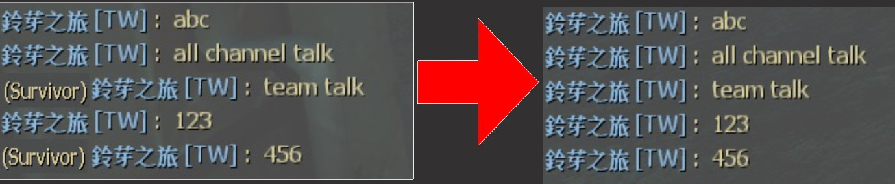

# Description | 內容
Redirecting all 'say_team' messages to 'say'

* Video | 影片展示
<br/>None

* Image | 圖示
	* No team chat ( 團隊聊天 變成 公開聊天)
	<br/>

* Require | 必要安裝
<br/>None

* <details><summary>ConVar | 指令</summary>

	* cfg/sourcemod/lfd_noTeamSay.cfg
		```php
        // Messages starting with this will be ignored, separate by , symbol
        noteamsay_ignorelist "!,/,@"
		```
</details>

* <details><summary>Command | 命令</summary>

	None
</details>

* Apply to | 適用於
	```
	L4D1
	L4D2
	```

* <details><summary>Related Plugin | 相關插件</summary>

	1. [sm_regexfilter](https://github.com/fbef0102/Game-Private_Plugin/tree/main/Plugin_%E6%8F%92%E4%BB%B6/Anti_Griefer_%E9%98%B2%E6%83%A1%E6%84%8F%E8%B7%AF%E4%BA%BA/sm_regexfilter): Filter dirty words via Regular Expressions
		> 禁詞表，任何人打字說出髒話或敏感詞彙，字詞會被屏蔽、玩家禁言並處死，網路並非法外之地
</details>

* <details><summary>Changelog | 版本日誌</summary>

	```php
	//bullet28 @ 2020
	//HarryPotter @ 2020-2023
	```
	* v2.4 (2023-5-20)
		* Fixed Error

	* v2.3 (2023-5-13)
		* Optimize Code

	* v2.2
        * Remake Code
        * Fixed compatibility with plugin "sm_regexfilter" 1.3 by Twilight Suzuka, HarryPotter

	* v1.0
		* [Original plugin by bullet28](https://forums.alliedmods.net/showthread.php?p=2691314)
</details>

- - - -
# 中文說明
沒有團隊聊天頻道只有公開聊天頻道

* 原理
	* 不管在哪一個頻道說話，全部的人都能看到

* 用意在哪?
    * 不說悄悄話
    * 比較方便，全體玩家打屁哈啦聊天

* 功能
    * 有 !、/、@ 特殊符號開頭的文字訊息不會公開
        * 譬如!admin、/nextmap、@hello