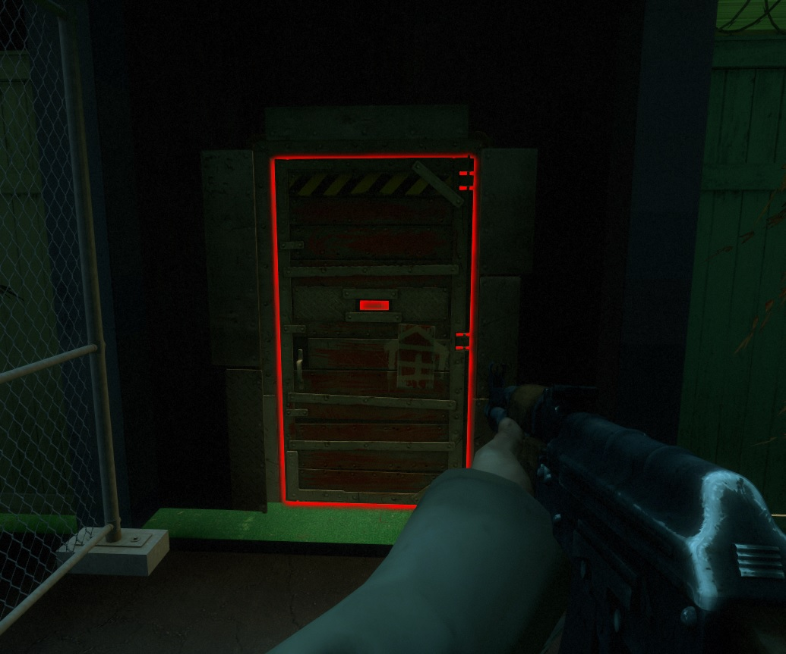
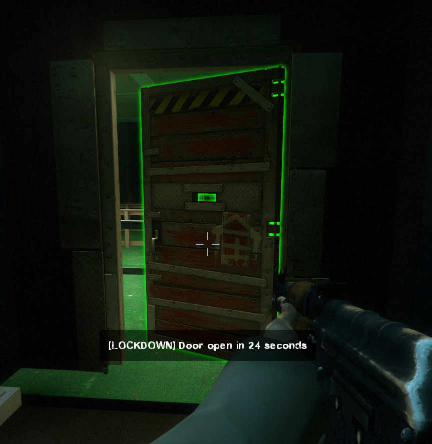
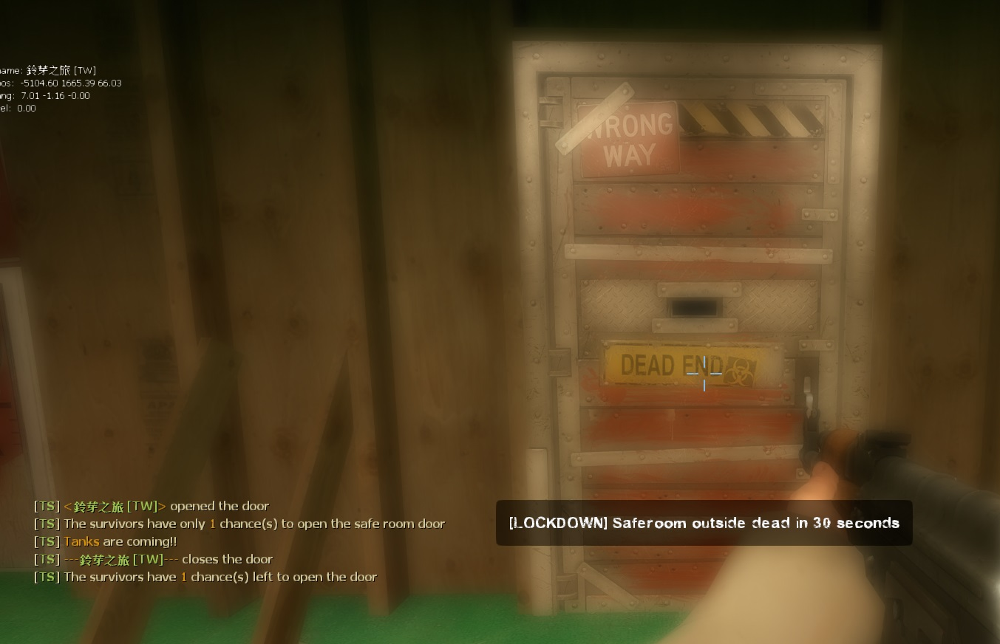

# Description | 內容
Locks Saferoom Door Until Someone Opens It.

* [Video | 影片展示](https://youtu.be/ayPZ-XUbBkc)

* Image | 圖示
    * End Saferoom Door Locked (終點安全門鎖住)
    <br/>
    * End Saferoom Door Opening (終點安全門正在打開)
    <br/>
    * Close Saferoom Door (關閉終點安全門)
    <br/>

* Require | 必要安裝
    1. [left4dhooks](https://forums.alliedmods.net/showthread.php?t=321696)
    2. [[INC] Multi Colors](https://github.com/fbef0102/L4D1_2-Plugins/releases/tag/Multi-Colors)
    3. [spawn_infected_nolimit](https://github.com/fbef0102/L4D1_2-Plugins/tree/master/spawn_infected_nolimit)

* <details><summary>ConVar | 指令</summary>

    * cfg/sourcemod/lockdown_system-l4d2.cfg
        ```php
        // If 1, Enable saferoom door status Announcements
        lockdown_system-l4d2_announce "1"

        // Duration Of Anti-Farm, locks door if tank is on the field
        lockdown_system-l4d2_anti-farm_duration "50"

        // Change how Count Down Timer Hint displays. (0: Disable, 1:In chat, 2: In Hint Box, 3: In center text)
        lockdown_system-l4d2_count_hint_type "2"

        // Duration Of end saferoom door opening
        lockdown_system-l4d2_duration "100"

        // (L4D2) The default value for saferoom door glow range.
        lockdown_system-l4d2_glow_range "550"

        // (L4D2) The default glow color for saferoom door when lock. Three values between 0-255 separated by spaces. RGB Color255 - Red Green Blue.
        lockdown_system-l4d2_lock_glow_color "255 0 0"

        // Number Of horde mobs to spawn (-1=Infinite horde, 0=Off)
        lockdown_system-l4d2_mobs "5"

        // After saferoom door is opened, how many chance can the survivors open the door. (0=Can't open door after close, -1=No limit)
        lockdown_system-l4d2_open_chance "2"

        // Time Interval to spawn a tank when door is opening (0=off)
        lockdown_system-l4d2_opening_tank_interval "50"

        // After end saferoom door is opened, slay players who are not inside saferoom in seconds. (0=off)
        lockdown_system-l4d2_outside_slay_duration "60"

        // What percentage of the ALIVE survivors must assemble near the saferoom door before open. (0=off)
        lockdown_system-l4d2_percentage_survivors_near_saferoom "50"

        // How many seconds to lock after opening and closing the saferoom door.
        lockdown_system-l4d2_prevent_spam_duration "3.0"

        // If 1, prevent AI survivor from opening and closing the door.
        lockdown_system-l4d2_spam_bot_disable "1"

        // If 1, Display a message showing who opened or closed the saferoom door.
        lockdown_system-l4d2_spam_hint "1"

        // If 1, Enable Tank Demolition, server will spawn tank after door open 
        lockdown_system-l4d2_tank_demolition_after "1"

        // If 1, Enable Tank Demolition, server will spawn tank before door open 
        lockdown_system-l4d2_tank_demolition_before "1"

        // 0=Off. 1=Teleport common, special infected if they touch the door inside saferoom when door is opening. (prevent spawning and be stuck inside the saferoom, only works if Lockdown Type is 2)
        lockdown_system-l4d2_teleport "1"

        // Lockdown Type: 0=Random, 1=Improved (opening slowly), 2=Default
        lockdown_system-l4d2_type "0"

        // (L4D2) The default glow color for saferoom door when unlock. Three values between 0-255 separated by spaces. RGB Color255 - Red Green Blue.
        lockdown_system-l4d2_unlock_glow_color "200 200 200"
        ```
</details>

* <details><summary>Command | 命令</summary>

    None
</details>

* <details><summary>Data Config</summary>
  
	* [data/mapinfo.txt](data/mapinfo.txt)
		```php
		"MapInfo"
		{
            "c1m3_mall" // map name
            {	
                "lockdown_system-l4d2_opening_tank" "2" //Numbers of tanks to spawn during opening door in this maps
            }
            
            "c10m3_ranchhouse"
            {
                "lockdown_system-l4d2_off" "1" // disable plugin in this map
            }

			...
		}
		```
</details>

* <details><summary>API | 串接</summary>

    ```c
    /**
    * @brief Called when saferoom door is completely opened
    *
    * @param sKeyMan    client name who opened the saferoom door.
    *
    * @noreturn
    */
    forward void L4D2_OnLockDownOpenDoorFinish(const char[] sKeyMan);
    ```
</details>

* Apply to | 適用於
    ```
    L4D1
    L4D2
    ```

* <details><summary>Related | 相關插件</summary>

    1. [end_safedoor_teleport](https://github.com/fbef0102/Game-Private_Plugin/tree/main/Plugin_%E6%8F%92%E4%BB%B6/Special_Infected_%E7%89%B9%E6%84%9F/end_safedoor_teleport): Teleport ci/si/tank outside the end saferoom if they spawn inside
        * 如果 普通感染者/特感/Tank 生在終點安全室裡面，則將他們傳送到門前 (避免卡在終點安全室裡面)
    2. [l4d_rescue_vehicle_leave_timer](https://github.com/fbef0102/L4D2-Plugins/tree/master/l4d_rescue_vehicle_leave_timer): When rescue vehicle arrived and a timer will display how many time left for vehicle leaving. If a player is not on rescue vehicle or zone, slay him
        * 救援來臨之後，未在時間內上救援載具逃亡的玩家將處死
    3. [antisaferoomdooropen](https://github.com/fbef0102/Game-Private_Plugin/tree/main/Plugin_%E6%8F%92%E4%BB%B6/Survivor_%E4%BA%BA%E9%A1%9E/antisaferoomdooropen): Start Saferoom door anti open + teleport survivor back to safe area when leaving out saferoom until certain time pass
        * 起始安全室的安全門將會鎖住直到時間結束 + 沒有安全門的關卡一旦離開安全區域會傳送回起始安全區域
    4. [Saferoom Lock Scavenge by Earendil](https://forums.alliedmods.net/showthread.php?p=2750321): Players must complete a small scavenge event to unlock the saferoom
        * 必須罐汽油桶才能解鎖安全門
</details>

* <details><summary>Changelog | 版本日誌</summary>

    * v5.9 (2024-5-1)
        * Make tank leave stasis when spawn during door opening

    * v5.7 (2024-2-4)
        * Update Cvars

    * v5.6 (2024-1-27)
        * Delete Gamedata
        * Require <spawn_infected_nolimit>

    * v5.5 (2023-6-20)
        * Require lef4dhooks v1.33 or above
        * Fixed bot unable to open and close normal door on the whole map.

    * v5.2
        * [AlliedModder Post](https://forums.alliedmods.net/showpost.php?p=2712869&postcount=54)
        * Remake Code
        * ProdigySim's method for indirectly getting signatures added, created the whole code for indirectly getting signatures so the plugin can now withstand most updates to L4D2! (Thanks to [Shadowysn](https://forums.alliedmods.net/showthread.php?t=320849) and [ProdigySim](https://github.com/ProdigySim/DirectInfectedSpawn))
        * Update L4D2 "The Last Stand" gamedata
        * Translation support
        * Workng in L4D2 "The Last Stand" Map
        * Replace Left 4 Downtown 2 extension with Left 4 DHooks Direct
        * Remove Convar "Lockdown_system-l4d(2)_menu".
        * fixed plugin not working in versus.
        * Percentage of the ALIVE survivors must assemble near the saferoom door before open. (prevent rushing players)
        * display who open/close the door
        * spawn a tank before door open
        * spawn multi tanks after door open
        * keep spawning a tank when door is opening (players will not feel boring)
        * display a message showing who opened or closed the saferoom door. (everyone will know who spamming the door)
        * after Safe room door is opened, set a timer to count down. Slay players who still are not inside the saferoom. (prevent cowards)
        * when door is opening, if any common or infected spawns inside the saferoom, teleport them outside. (prevent being stuck inside the saferoom)
        * stop AI survivor from opening and closing the door. (prevent stupid bots from spamming the door)
        * Set the door glow color
        * Seconds to lock door after opening and closing the saferoom door.
        * after saferoom door is opened, how many chance can the survivors open the door. (stop noobs from playing the doors)
        * Made compatible with the "Saferoom Lock: Scavenge" plugin version 1.2.2+ by Earendil.
        
    * v1.7
        * [Original Post by cravenge](https://forums.alliedmods.net/showthread.php?t=281305)
</details>

- - - -
# 中文說明
倖存者必須等待時間到並合力對抗屍潮與Tank才能打開終點安全門

* 原理
    * 終點安全室的大門會先鎖住直到有人來開門
    * 大門打開期間會有屍潮與Tank來襲，倖存者們必須合力抵抗才能度過難關
    * 大門打開之後必須趕快進去安全室內並關上門，否則會被處死

* <details><summary>指令中文介紹 (點我展開)</summary>

    * cfg/sourcemod/lockdown_system-l4d2.cfg
        ```php
        // 為1時, 顯示終點安全室大門的狀態
        lockdown_system-l4d2_announce "1"

        // 當有人開門並且有Tank在場時，必須等待50秒或者殺死Tank <= 避免略過tank不殺死直衝終點
        lockdown_system-l4d2_anti-farm_duration "50"

        // 開門倒數計時該如何顯示? (0: 不顯示, 1: 聊天視窗, 2: 下方黑底白字, 3: 螢幕中央)
        lockdown_system-l4d2_count_hint_type "2"

        // 終點安全室大門開啟時間
        lockdown_system-l4d2_duration "100"

        // (L4D2) 終點安全室大門發光的範圍
        lockdown_system-l4d2_glow_range "550"

        // (L4D2) 終點安全室大門鎖住狀態的光圈顏色
        lockdown_system-l4d2_lock_glow_color "255 0 0"

        // (L4D2) 終點安全室大門解鎖狀態的光圈顏色
        lockdown_system-l4d2_unlock_glow_color "200 200 200"

        // 終點安全室大門開啟期間屍潮生成的數量 (-1=無限屍潮, 0=不要生成屍潮)
        lockdown_system-l4d2_mobs "5"

        // 終點安全室大門開啟之後，倖存者只有兩次機會能再度打開大門. (0=關閉之後不能再打開, -1=無限制) <= 不給傻B機會
        lockdown_system-l4d2_open_chance "2"

        // 終點安全室大門開啟期間，每50秒生成一隻Tank (0=不生成)
        lockdown_system-l4d2_opening_tank_interval "50"

        // 終點安全室大門開啟之後經過60秒，如果還有倖存者逗留在門外，將處死 (0=關閉) <= 避免傻B在外面逗留
        lockdown_system-l4d2_outside_slay_duration "60"

        // 必須隊內存活的倖存者們有50%的人集合在安全室附近，才能打開大門 (0=關閉)  <= 避免傻B一個人拋棄隊伍抵達安全室
        lockdown_system-l4d2_percentage_survivors_near_saferoom "50"

        // 開關門之後鎖住3秒鐘，任何人不得開關門 <= 避免傻B在玩門
        lockdown_system-l4d2_prevent_spam_duration "3.0"

        // 為1時, 禁止Bot開門與關門
        lockdown_system-l4d2_spam_bot_disable "1"

        // 為1時, 顯示哪位玩家開關門.  <= 可以知道誰是兇手開門
        lockdown_system-l4d2_spam_hint "1"

        // 為1時, 大門開啟之後，生成大量的Tank
        lockdown_system-l4d2_tank_demolition_after "1"

        // 為1時, 大門開啟之前，生成一隻Tank
        lockdown_system-l4d2_tank_demolition_before "1"

        // 0=關閉. 1=大門開啟期間，安全室內的普通感染者與特感碰到門會傳送到門外 (避免他們都生在室內卡住, 只有lockdown_system-l4d2_type指令是2才會運作)
        lockdown_system-l4d2_teleport "1"

        // 終點安全室大門開啟方式: 0=隨機, 1=緩慢地打開, 2=預設
        lockdown_system-l4d2_type "0"
        ```
</details>

* <details><summary>文件設定範例</summary>
  
	* [data/mapinfo.txt](data/mapinfo.txt)
		```php
		"MapInfo"
		{
            "c1m3_mall" // 地圖名
            {	
                "lockdown_system-l4d2_opening_tank" "2" // 大門開啟期間，生成Tank的數量 (沒有寫則預設是1)
            }
            
            "c10m3_ranchhouse"
            {
                "lockdown_system-l4d2_off" "1" // 1=在這張地圖關閉此插件 (沒有寫則自動開啟)
            }

			...
		}
		```
</details>