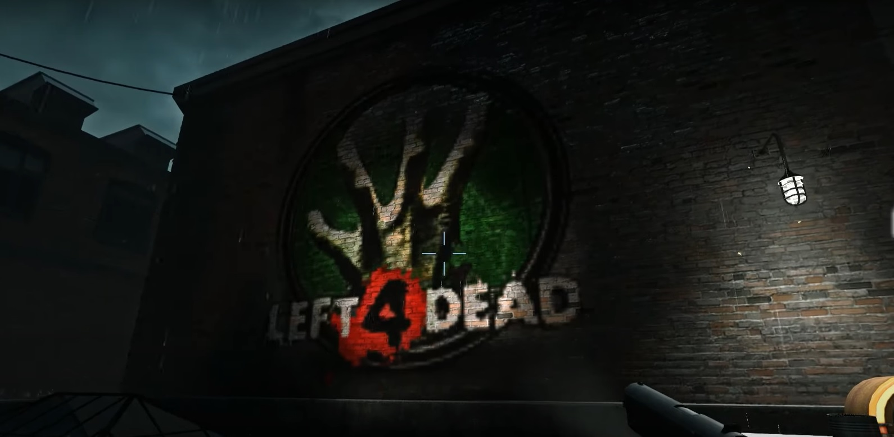
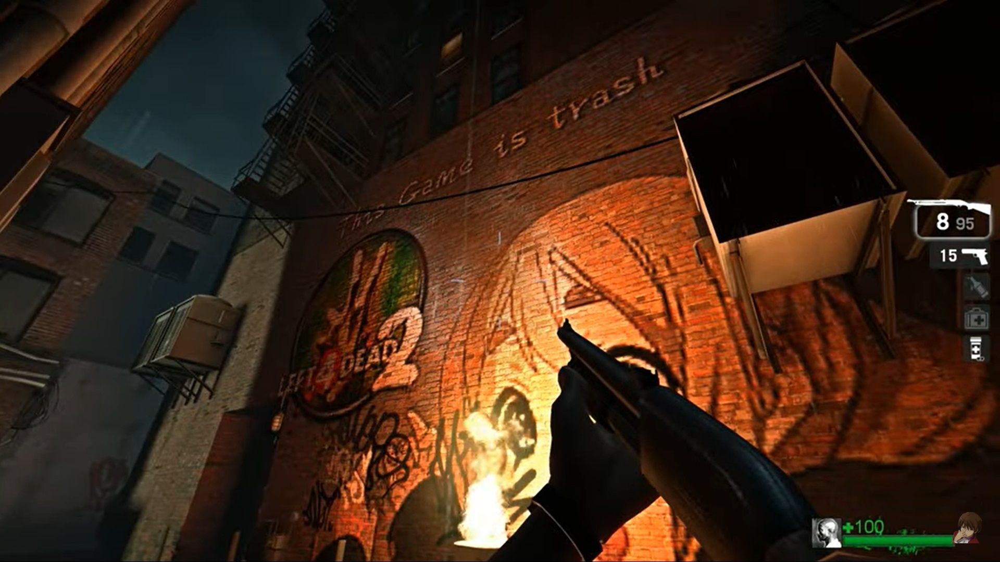

# Description | 內容
Allows admins to place any decals into the map that are defined in the the config and save them permanently for each map

* [Video | 影片展示](https://youtu.be/VGWEMl-6IgQ)

* Image | 圖示
	<br/>
	<br/>
	<br/>

* Require | 必要安裝
<br/>None

* Notice
	* 🟥 Prepare your content-server for FastDL, othersie this plugin will not work
	* If you don't know what "FastDL" is, please google it

* <details><summary>ConVar | 指令</summary>

    * cfg/sourcemod/map-decals.cfg
	```php
	// How far away from the Decals position it will be traced to and check distance to prevent painting a Decal over another
	md_decal_dista "50.0"

	// Turns on/off printing out of decal positions
	md_decal_printpos "1"

	// Path to the spray sound used by map-decals plugin
	md_decal_spraysound "player/sprayer.wav"

	// what kind of way to download decals? [0 - all at once, 1 - depend on Map specific configs]
	md_download_style "1"
	```
</details>

* <details><summary>Command | 命令</summary>
    
	* **Paints a decal on the wall you are currently aiming at (Adm required: Custom3)**
	```php
	sm_paintdecal <decalname | decal_id>
	```

	* **Currently not implemented, change map to reload the decals from the config file. (Adm required: Root)**
	```php
	sm_removedecal <aim | all | id | name | last>
	```

	* **Saves the decal position to the map specific config file. (Adm required: Root)**
	```php
	sm_savedecal <aim | all | id | name | last>
	```

	* **Lists decals (Adm required: Custom3)**
	```php
	sm_listdecal <aim | all | id | last | map | name | saved>
	```

	* **Shows current aim position (Adm required: Custom3)**
	```php
	sm_aimpos
	```

	* **Map Decals Menu for Admins (Adm required: Custom3)**
	```php
	sm_decalmenu
	```
</details>

* <details><summary>Data Example</summary>

	* [configs\map-decals\decals.cfg](addons\sourcemod\configs\map-decals\decals.cfg)
		```php
		"Decals"
		{
			"decalname" //<-Name whatever you want
			{
				"path"	"decals/TS_SERVER/TS_base" //<--decal file path, relative to the /materials/ folder
			}
		}	
		```
</details>

* <details><summary>How do I add a new decal</summary>

	1. Preparation of vmt/vtf files
		* Tool - [VTFEdit](https://nemstools.github.io/pages/VTFLib-Download.html)
		* Valve Developer Community - [Decals](http://developer.valvesoftware.com/wiki/Decals)
		* file names
			* Ensure no file has space or special characters like "long dash" (–) or so.
		* file size
			* Next, it is recommended every file will not be > 5 MB. in size (to improve download speed).
			* To decrease the size, Compress .vtf to .vtf.bz2 [file archiver 7-Zip Portable](https://portableapps.com/apps/utilities/7-zip_portable)

	2. Preparation the list
		* Download all files(addons and materials).
		* Put them in your game folder
    		* If L4D1, ```Left 4 Dead Dedicated Server\left4dead```
    		* If L4D2, ```Left 4 Dead 2 Dedicated Server\left4dead2```
		* Copy YOUR vtf files to the materials/decals/TS_SERVER directory, at least they should be in materials, otherwise it won't work. Edit your .vmt file with a text editor if neccesary, to change the path to the .vmt file.
		* Add the path of the decal to the main config file [addons\sourcemod\configs\map-decals\decals.cfg](addons\sourcemod\configs\map-decals\decals.cfg). The path has to be put relative to the materials folder, and without the file extension.
		* Prepare your content-server for FastDL, if you don't know what "FastDL" is, please google it

	3. Setup server to work with downloadable content
		* ConVars in your cfg/server.cfg should be:
			* If you are L4D1
			```php
			sm_cvar sv_allowdownload "1"
			sm_cvar sv_downloadurl "http://your-content-server.com/game/left4dead/"
			```
			* If you are L4D2
			```php
			sm_cvar sv_allowdownload "1"
			sm_cvar sv_downloadurl "http://your-content-server.com/game/left4dead2/"	
			```

	4. Uploading files to server.
		* Upload "materials" folder to content-server
			* If you are L4D1, ```your-content-server.com/game/left4dead/materials/``` 
			* If you are L4D2, ```your-content-server.com/game/left4dead2/materials/```
		* Upload "materials" folder to your game server.
    		* If you are L4D1, ```Left 4 Dead Dedicated Server\left4dead\materials\```
    		* If you are L4D2, ```Left 4 Dead 2 Dedicated Server\left4dead2\materials\```
		* Upload "materials" folder to your client's game folder (for test).
    		* If you are L4D1, ```left 4 dead\left4dead\materials\```
    		* If you are L4D2, ```Left 4 Dead 2\left4dead2\materials\```

	5. Start the server and test
		* Launch your game, Options-> Multiplayer -> CUSTOM SERVER CONTENT -> Allow All
		<br/>
		* Connect to server.
		* Aim at a wall and use !paintdecal <decalname> the name you just type in decal.cfg
		* say !savedecal to save a Decal to the config whilst aiming at it, "!savedecal all" saves all Decals (on current Map), "!savedecal [id]" saves a Decal by id, "!savedecal [last]" saves last painted Decal, "!savedecal [name]" saves all Decals by decalname (on current Map)
		* The decals will be saved to configs\map-decals\maps\XXXXXX.cfg (XXXXXX is map name)
		* Restart map to see if the Decal is already on the wall
</details>

* Apply to | 適用於
	```
	L4D1
	L4D2
	```

* <details><summary>Translation Support | 支援翻譯</summary>

	```
	English
	繁體中文
	简体中文
	Russian
	German
	```
</details>

* <details><summary>Changelog | 版本日誌</summary>

    * 1.4 (2022-07-28)
	    * add new convar.
	    * player only downloads decals depending on Map specific configs
	    * fix translation error
	    * fix file error
    * v1.1
	    * [original plugin by berni](https://forums.alliedmods.net/showthread.php?t=69502)
</details>

- - - -
# 中文說明
允許管理員將任何塗鴉放置在配置中定義的地圖中，並為每個地圖永久保存它們

* 原理
    * 在地圖的牆壁上放置海報並儲存，所有玩家都能看到
	* 🟥 需自備網空且支援FastDL，上傳vmt/vtf文件，客戶端才能下載檔案 (不知道什麼是FastDL請自行Google)

* <details><summary>指令中文介紹 (點我展開)</summary>

	* cfg/sourcemod/map-decals.cfg
		```php
		// 塗鴉位置能被追蹤多遠，並檢查距離以防止在另一個塗鴉上繪製一個塗鴉
		md_decal_dista "50.0"

		// 打印塗鴉位置
		md_decal_printpos "1"

		// map-decals 當使用塗鴉時的聲音來源路徑
		md_decal_spraysound "player/sprayer.wav"

		// 什麼樣的方式來下載塗鴉？[0 - 一次全部，1 - 取決於地圖特定的配置]
		md_download_style "1"
		```
</details>

* <details><summary>命令中文介紹 (點我展開)</summary>

	* **在您當前瞄準的牆上繪製塗鴉需要管理員權限 (權限：Custom3)**
		```php
		sm_paintdecal <decalname | decal_id>
		```

	* **目前尚不完整，更換地圖以從配置文件重新加載塗鴉。 (Adm required: Root)**
	```php
	sm_removedecal <aim | all | id | name | last>
	```

	* **將塗鴉位置保存到地圖特定的配置文件中。 (Adm required: Root)**
	```php
	sm_savedecal <aim | all | id | name | last>
	```

	* **列出塗鴉位置 (Adm required: Custom3)**
	```php
	sm_listdecal <aim | all | id | last | map | name | saved>
	```

	* **顯示當前位置 (Adm required: Custom3)**
	```php
	sm_aimpos
	```

	* **管理員的地圖塗鴉選單 (Adm required: Custom3)**
	```php
	sm_decalmenu
	```
</details>

* <details><summary>Data設定範例</summary>

	* [configs\map-decals\decals.cfg](addons\sourcemod\configs\map-decals\decals.cfg)
		```php
		"Decals"
		{
			"decalname" //<-為這個塗鴉命名，可隨便取，不要中文
			{
				"path"	"decals/TS_SERVER/TS_base" //<-圖片路徑，路徑必須相對於"materials"資料夾，不需要寫上副檔名，不要中文
			}
		}	
		```
</details>

* <details><summary>如何添加新塗鴉</summary>

	1. 準備vmt/vtf文件
		* 工具 - [VTFEdit](https://nemstools.github.io/pages/VTFLib-Download.html)
		* Valve 開發者社區 - [塗鴉](http://developer.valvesoftware.com/wiki/Decals)
		* 文件名
			* 確保沒有文件有空格或特殊字符，如"長破折號"(–) 等。
			* 不能有中文
			
		* 文件大小
			* 接下來，建議每個文件不要> 5 MB。大小（以提高下載速度）。
			* 要減小大小，將 .vtf 壓縮為 .vtf.bz2 [文件歸檔程序 7-Zip Portable](https://portableapps.com/apps/utilities/7-zip_portable)
		
	2. 準備清單
		* 下載所有文件（插件和材料）。
		* 將它們放在遊戲伺服器資料夾中
    		* 如果你是 L4D1，```Left 4 Dead Dedicated Server\left4dead```
    		* 如果你是 L4D2，```Left 4 Dead 2 Dedicated Server\left4dead2```
		* 將你的vtf文件複製到materials/decals/TS_SERVER目錄下，至少應該在materials裡面，否則不行。如果需要，請使用文本編輯器編輯 .vmt 文件，以更改 .vmt 文件的路徑。
		* 將塗鴉的路徑添加到主配置文件[addons\sourcemod\configs\map-decals\decals.cfg](addons\sourcemod\configs\map-decals\decals.cfg)。路徑必須相對於materials資料夾，不需要寫上副檔名。
		* 準備你的網空並可以支援FastDL, 不知道什麼是FastDL請自行Google
		
	3. 設置伺服器以處理可下載的內容
		* 寫入以下內容到cfg/server.cfg
			* 如果你是 L4D1
				```php
				sm_cvar sv_allowdownload "1"
				sm_cvar sv_downloadurl "http://your-content-server.com/game/left4dead/"
				```
			* 如果你是 L4D2
				```php
				sm_cvar sv_allowdownload "1"
				sm_cvar sv_downloadurl "http://your-content-server.com/game/left4dead2/"	
				```
		
	4. 上傳文件到伺服器。
		* 將"materials"資料夾上傳到網空伺服器
			* 如果你是 L4D1，```your-content-server.com/game/left4dead/materials/```
			* 如果你是 L4D2，```your-content-server.com/game/left4dead2/materials/```
		* 將"materials"資料夾複製到您的遊戲伺服器資料夾。
    		* 如果你是 L4D1，```Left 4 Dead Dedicated Server\left4dead\materials\```
    		* 如果你是 L4D2，```Left 4 Dead 2 Dedicated Server\left4dead2\materials\```
		* 將"materials"資料夾上傳到您的遊戲資料夾（用於測試）。
    		* 如果你是 L4D1，```left 4 dead\left4dead\materials\```
    		* 如果你是 L4D2，```Left 4 Dead 2\left4dead2\materials\```

	5. 啟動伺服器並測試
		* 打開你的遊戲，選項->多人連線->自訂伺服器內容->全部允許
		<br/>
		* 連線到伺服器
		* 瞄準牆壁並使用 !paintdecal <decalname> 打上你剛才在decal.cfg文件裡取的命名
		* 現在您可以使用 !savedecal 將瞄準的現存塗鴉保存到配置中
		* 保存配置位於 configs\map-decals\maps\XXXXXX.cfg (XXXXXX 是地圖名)
		* 重啟地圖，查看塗鴉是否已經在牆壁上
</details>