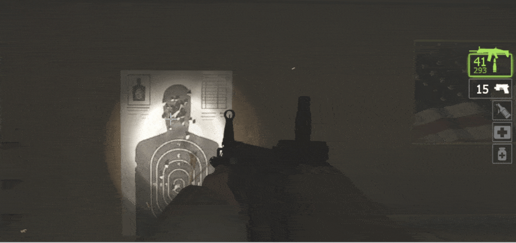

https://forums.alliedmods.net/showthread.php?t=349202

# Description | 內容
Full auto mode for SCAR

* Apply to | 適用於
	```
	L4D2
	```

* Image | 圖示
    <br/>

* <details><summary>How does it work?</summary>

	* Use mouse3 to change mode when using scar
		* Triple Tap
		* Full Auto
	* 🟥 This plugin changed a lot of weapon settings when using Full Auto Scar
		* Don't expect this plugin is compatible with other plugins that modify scar weapon too
</details>

* Require | 必要安裝
	1. [left4dhooks](https://forums.alliedmods.net/showthread.php?t=321696)

* <details><summary>ConVar | 指令</summary>

	* cfg/sourcemod/miuwiki_autoscar.cfg
		```php
		// Scar full Auto cycle time. [min 0.03]
		miuwiki_autoscar_cycletime "0.11"

		// Scar full Auto reload time. [min 0.5, 0=Same as Triple Tap default reload time]
		miuwiki_autoscar_reloadtime "0"

		// 1=Enable chat notify, 0=Disable chat notify
		miuwiki_autoscar_notify "1"

		// Which mode by default when client joins server? 0=Triple Tap, 1=Full Auto
		miuwiki_autoscar_default "0"

		// Press which button to trigger full auto mode, 131072=Shift, 32=Use, 8192=Reload, 524288=Middle Mouse
		// You can add numbers together, ex: 655360=Shift + Middle Mouse
		miuwiki_autoscar_buttons "524288"
		```
</details>

* <details><summary>API | 串接</summary>

	* [miuwiki_autoscar.inc](scripting/include/miuwiki_autoscar.inc)
		```php
		library name: miuwiki_autoscar
		```
</details>

* <details><summary>Related Plugin | 相關插件</summary>

	1. [l4d_drop](/l4d_drop): Allows players to drop the weapon they are holding
		* 玩家可自行丟棄手中的武器
	2. [l4d2_weapon_csgo_reload](/l4d2_weapon_csgo_reload): Quickswitch Reloading like CS:GO in L4D2
		* 將武器改成現代遊戲的裝子彈機制 (仿CS:GO切槍裝彈設定)
</details>

* <details><summary>Changelog | 版本日誌</summary>

	* v1.0h (2025-2-15)
		* Optimize code to detect frame of scar rifle
		* Update cvars
		* Fixed unable to shoot or reload on windows server
		* Add sound when switch to Full Auto
		* Remove IsGettingUp singature
		* Can't switch mode when reloading
		* Add cfg and API
		* Replace StoreToAddress with SetEntData to prevent crash: tier0.dll + 0x1991d
		* Compatible with "l4d2_weapon_csgo_reload", "l4d_drop" by harry

	* Original & Credit
		* [LinLinLin](https://forums.alliedmods.net/showthread.php?t=349202)
</details>

- - - -
# 中文說明
SCAR三連發步槍可以切換成全自動模式

* 原理
	* 拿著SCAR步槍，按一下"滾輪鍵"可以切換模式
		* 三連發
		* 全自動
	* 🟥 此插件使用大量武器簽名以運作全自動SCAR步槍，所以別指望使用這插件時會與其他影響武器的插件兼容

* <details><summary>指令中文介紹 (點我展開)</summary>

	* cfg/sourcemod/miuwiki_autoscar.cfg
		```php
		// 全自動SCAR步槍的射速. [最小: 0.03]
		miuwiki_autoscar_cycletime "0.11"

		// 全自動SCAR步槍的裝彈時間. [最小: 0.5, 0=與三連發模式裝彈時間一樣]
		miuwiki_autoscar_reloadtime "0"

		// 1=啟用提示, 0=不啟用提示
		miuwiki_autoscar_notify "1"

		// 玩家進來伺服器時預設使用何種模式, 0=三連發, 1=全自動
		miuwiki_autoscar_default "0"

		// 使用哪個按鍵切換模式? 131072=Shift鍵, 32=E鍵, 8192=R鍵, 524288=滾輪鍵
		// 可以數字相加, 譬如: 655360=必須同時按 "Shift鍵+滾輪鍵"
		miuwiki_autoscar_buttons "524288"
		```
</details>