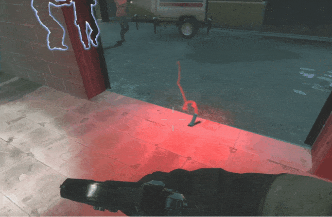

# Description | 內容
Prevents firework crates, gascans, oxygen, propane tanks and pipe bombs being pushed when players walk into them

* Image | 圖示
    <br/>
    <br/>

* Apply to | 適用於
	```
	L4D1
	L4D2
	```

* <details><summary>How does it work?</summary>

	* To to fix the bug where survivor push gascans or pipebomb projectiles by accident
	* How to reproduce the bug?
		* Find a gascan on the map, don't grab, just walk into it
		* Throw a pipebomb, your teammates walk into it
	* After install this plugin, pipebombs would fly through the tank body.
</details>

* Require | 必要安裝
<br/>None

* <details><summary>Changelog | 版本日誌</summary>

	* v1.0h (2025-1-4)
		* Remake code
		* Add pipebomb
		* Add prop_physics, prop_physics_override, prop_physics_multiplayer

	* Original
		* [By Lux](https://forums.alliedmods.net/showthread.php?t=325263)
</details>

- - - -
# 中文說明
修復玩家走路就能推擠地上物品或土製炸彈

* 原理
	* 官方的Bug: 玩家走路就能推擠地上的物品 (汽油桶、瓦斯桶、煙火盒、氧氣罐、土製炸彈)
	* 如何復現?
		* 找到地圖上的汽油桶，不要拿取，直接走過去
		* 丟出一個土製炸彈，你的隊友直接走過去
	* 安裝此插件後的副作用: 土製炸彈會穿透Tank身體