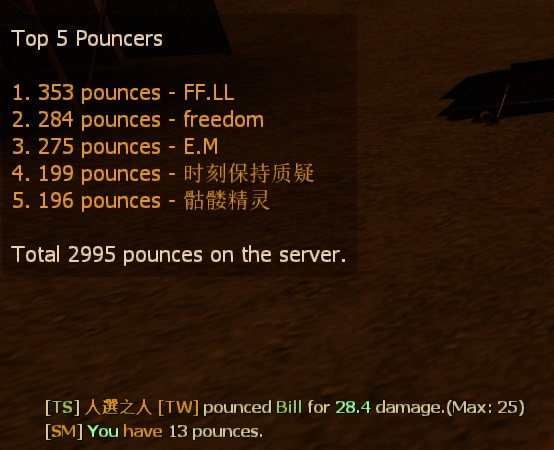

# Description | 內容
Announces hunter pounces to the entire server, and save record to data/pounce_database.tx

* Video | 影片展示
<br/>None

* Image | 圖示
	* Hunter High Pounce notify and Top 5 pouncers (高撲提示與前五名)
    <br/>

* <details><summary>How does it work?</summary>

	* When hunter player does 25 high pounce damage, announces to the entire server
	* And save record to [data/pounce_database.txt](data/pounce_database.txt)
</details>

* Require | 必要安裝
<br/>None

* <details><summary>ConVar | 指令</summary>

	* cfg/sourcemod/pounce_database.cfg
        ```php
		// Enable this plugin?
		pounce_database_enable "1"

		// The minimum amount of damage required to record the pounce
		pounce_database_minimum "25"

		// Announces the pounce in chatbox.
		pounce_database_announce "0"

		// Turn on the plugin in these game modes. 0=All, 1=Coop, 2=Survival, 4=Versus. Add numbers together.
		pounce_database_modes_tog "4"

		// Numbers of Survivors required at least to enable this plugin
		pounce_database_survivors_required "4"
		```
</details>

* <details><summary>Command | 命令</summary>

	* **Show your current pounce statistics and rank.**
		```php
		sm_pounces
		```

	* **Show TOP 5 pounce players in statistics.**
		```php
		sm_pounce5
		```
</details>

* Apply to | 適用於
    ```
    L4D1
    L4D2
    ```

* <details><summary>Changelog | 版本日誌</summary>

	* v1.3 (2023-6-12)
		* Fix out of memory error

	* v1.2
        * Initial Release
</details>

- - - -
# 中文說明
統計高撲的數量與顯示前五名高撲的大佬 (支援文件儲存)

* 原理
	* 當玩家被高撲顯示提示與前五名排名
	* 高撲Bot不會生效
	* 倖存者隊伍有四位以上的真人玩家才會生效
	* 高撲的數量與統計會寫入[data/pounce_database.txt](data/pounce_database.txt)，因此就算重開服也不會重置統計

* <details><summary>指令中文介紹 (點我展開)</summary>

	* cfg/sourcemod/pounce_database.cfg
        ```php
		// 0=關閉插件, 1=啟動插件
		pounce_database_enable "1"

		// 高撲傷害超過25以上才會列入並計算
		pounce_database_minimum "25"

		// 為1時，聊天窗提示
		pounce_database_announce "0"

		// 什麼模式下啟動此插件. 0=所有模式, 1=戰役, 2=生存, 4=對抗, 8=清道夫. 請將數字相加起來
		pounce_database_modes_tog "4"

		// 倖存者隊伍至少需要的真人玩家，才會啟動此插件
		pounce_database_survivors_required "4"
		```
</details>

* <details><summary>命令中文介紹 (點我展開)</summary>

	* **顯示你的高撲統計與排行.**
		```php
		sm_pounces
		```

	* **查看前五名高撲的大佬.**
		```php
		sm_pounce5
		```
</details>