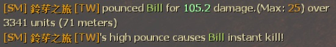

# Description | 內容
Announces hunter pounces to the entire server

* Apply to | 適用於
	```
	L4D1
	L4D2
	```

* Image | 圖示
	* Hunter high pounce (顯示Hunter的高撲資訊)
	<br/>
	* Hunter high pounce instant kill (Hunter的高撲夠高造成致命一擊)
	<br/>

* Require | 必要安裝
	1. [[INC] Multi Colors](https://github.com/fbef0102/L4D1_2-Plugins/releases/tag/Multi-Colors)

* <details><summary>ConVar | 指令</summary>

	* cfg/sourcemod/pounceannounce.cfg
		```php
        // Caps the displayed pounce damage to the maximum able to be dealt.
        pounceannounce_capdamage "0"

        // Announces the pounce to 0: chatbox, 1: center chat.
        pounceannounce_centerchat "0"

        // The minimum amount of damage required to instantly kill survivor. (0=Off)
        pounceannounce_killdamage "0"

        // The minimum amount of damage required to announce the pounce
        pounceannounce_minimum "10"

        // Show the distance the hunter traveled for the pounce.
        // 1=units, 2=units & feet, 3=units & meters, 4=feet, 5=meters
        pounceannounce_showdistance "3"
		```
</details>

* <details><summary>How to change max pounce damage in l4d1</summary>

    1. Install [pounce_maxdamage](https://github.com/fbef0102/Rotoblin-AZMod/blob/master/SourceCode/scripting-az/pounce_maxdamage.sp)
	2. write down the following cvars in cfg/server.cfg
		```php
		// Sets the new maximum hunter pounce damage.
		sm_cvar pounceuncap_maxdamage 100
		```
</details>

* <details><summary>How to change max pounce damage in l4d2</summary>

    1. Install [accelerator74/Pounce-Damage-Uncap](https://github.com/accelerator74/Pounce-Damage-Uncap/actions)
	2. write down the following cvars in cfg/server.cfg
        * default 25
            ```php
            // z_pounce_damage_range_max = ((z_hunter_max_pounce_bonus_damage / 24) * 700) + z_pounce_damage_range_min
            sm_cvar z_hunter_max_pounce_bonus_damage 24
            sm_cvar z_pounce_damage_range_min 300
            sm_cvar z_pounce_damage_range_max 1000
            ```
        * Max Pounce Damage 30
            ```php
            // z_pounce_damage_range_max = ((29 / 24) * 700) + 300
            sm_cvar z_hunter_max_pounce_bonus_damage 29
            sm_cvar z_pounce_damage_range_min 300
            sm_cvar z_pounce_damage_range_max 1145.833
            ```
        * Max Pounce Damage 75
            ```php
            // z_pounce_damage_range_max = ((74 / 24) * 700) + 300
            sm_cvar z_hunter_max_pounce_bonus_damage 29
            sm_cvar z_pounce_damage_range_min 300
            sm_cvar z_pounce_damage_range_max 2458.333
            ```
        * Max Pounce Damage 100
            ```php
            // z_pounce_damage_range_max = ((99 / 24) * 700) + 300
            sm_cvar z_hunter_max_pounce_bonus_damage 99
            sm_cvar z_pounce_damage_range_min 300
            sm_cvar z_pounce_damage_range_max 3187.5
            ```
        * Max Pounce Damage 200
            ```php
            // z_pounce_damage_range_max = ((199 / 24) * 700) + 300
            sm_cvar z_hunter_max_pounce_bonus_damage 199
            sm_cvar z_pounce_damage_range_min 300
            sm_cvar z_pounce_damage_range_max 6104.167
            ```
</details>

* <details><summary>Related Plugin | 相關插件</summary>

	1. [pounce_maxdamage](https://github.com/fbef0102/Rotoblin-AZMod/blob/master/SourceCode/scripting-az/pounce_maxdamage.sp): Makes it easy to properly uncap hunter pounces
		> (L4D1) 可以改變最大高撲的傷害值
	2. [accelerator74/Pounce-Damage-Uncap](https://github.com/accelerator74/Pounce-Damage-Uncap/actions): Change the pounce range and max pounce damage in L4D2
		> (L4D2) 可以改變最大高撲的傷害值
</details>

* <details><summary>Changelog | 版本日誌</summary>

	* v1.9 (2023-3-24)
		* Remake code, convert code to latest syntax
		* Fix warnings when compiling on SourceMod 1.11.
		* Optimize code and improve performance
		* The minimum amount of damage required to instantly kill survivor.

	* v1.5
		* [Original Plugin by n0limit](https://forums.alliedmods.net/showthread.php?t=93605)
</details>

- - - -
# 中文說明
顯示Hunter造成的高撲傷害與高撲距離

* 原理
	* 當AI Hunter或者真人Hunter造成高撲傷害時，顯示資訊給所有玩家
		* 受害者
        * 高撲傷害
        * 伺服器允許的最大高撲傷害
        * 距離
    * 當AI Hunter或者真人Hunter造成高撲傷害夠高時，造成倖存者當場死亡 (有指令可以關閉此功能)

* <details><summary>指令中文介紹 (點我展開)</summary>

	* cfg/sourcemod/pounceannounce.cfg
		```php
        // 只顯示高撲真正造成的實際傷害
        pounceannounce_capdamage "0"

        // 提示該如何顯示. 0: 聊天框, 1: 螢幕正中間
        pounceannounce_centerchat "0"

        // 高撲傷害超過一個數值會造成倖存者當場死亡 (0=關閉此功能)
        pounceannounce_killdamage "0"

        // The minimum amount of damage required to announce the pounce
        pounceannounce_minimum "10"

        // 距離的顯示單位
        // 1=單位, 2=單位 & 呎, 3=單位 & 公尺, 4=呎, 5=公尺
        pounceannounce_showdistance "3"
		```
</details>

* <details><summary>惡靈勢力一代中修改最大高撲傷害</summary>

    1. 安裝 [pounce_maxdamage](https://github.com/fbef0102/Rotoblin-AZMod/blob/master/SourceCode/scripting-az/pounce_maxdamage.sp)
	2. 以下指令寫入文件 cfg/server.cfg，可自行調整
		```php
		// Sets the new maximum hunter pounce damage.
		sm_cvar pounceuncap_maxdamage 100
		```
</details>

* <details><summary>惡靈勢力二代中修改最大高撲傷害</summary>

    1. 安裝 [accelerator74/Pounce-Damage-Uncap](https://github.com/accelerator74/Pounce-Damage-Uncap/actions)
	2. 以下指令寫入文件 cfg/server.cfg，可自行調整
        * 預設最大高撲傷害: 25
            ```php
            // z_pounce_damage_range_max = ((z_hunter_max_pounce_bonus_damage / 24) * 700) + z_pounce_damage_range_min
            sm_cvar z_hunter_max_pounce_bonus_damage 24
            sm_cvar z_pounce_damage_range_min 300
            sm_cvar z_pounce_damage_range_max 1000
            ```
        * 最大高撲傷害: 30
            ```php
            // z_pounce_damage_range_max = ((29 / 24) * 700) + 300
            sm_cvar z_hunter_max_pounce_bonus_damage 29
            sm_cvar z_pounce_damage_range_min 300
            sm_cvar z_pounce_damage_range_max 1145.833
            ```
       * 最大高撲傷害: 75
            ```php
            // z_pounce_damage_range_max = ((74 / 24) * 700) + 300
            sm_cvar z_hunter_max_pounce_bonus_damage 29
            sm_cvar z_pounce_damage_range_min 300
            sm_cvar z_pounce_damage_range_max 2458.333
            ```
        * 最大高撲傷害: 100
            ```php
            // z_pounce_damage_range_max = ((99 / 24) * 700) + 300
            sm_cvar z_hunter_max_pounce_bonus_damage 99
            sm_cvar z_pounce_damage_range_min 300
            sm_cvar z_pounce_damage_range_max 3187.5
            ```
        * 最大高撲傷害: 200
            ```php
            // z_pounce_damage_range_max = ((199 / 24) * 700) + 300
            sm_cvar z_hunter_max_pounce_bonus_damage 199
            sm_cvar z_pounce_damage_range_min 300
            sm_cvar z_pounce_damage_range_max 6104.167
            ```
</details>

