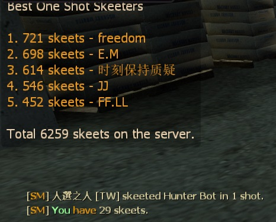

# Description | 內容
Announce hunter skeet to the entire server, and save record to data/skeet_database.txt

* Video | 影片展示
<br/>None

* Image | 圖示
	* Hunter Skeet notify and Top 5 Skeeters (一槍秒殺Hunter的提示與前五名)
    <br/>

* <details><summary>How does it work?</summary>

	* When player skeets hunter in one shot, announces to the entire server
	* And save record to [data/skeet_database.txt](data/skeet_database.txt)
</details>

* Require | 必要安裝
<br/>None

* <details><summary>ConVar | 指令</summary>

	* cfg/sourcemod/skeet_database.cfg
        ```php
		// Enable this plugin?
		skeet_database_enable "1"

		// Only count 'One Shot' skeet? [1: Yes, 0: No]
		skeet_database_announce_oneshot "1"

		// Announce skeet/shots in chatbox when someone skeets.
		skeet_database_announce "0"

		// Turn on the plugin in these game modes. 0=All, 1=Coop, 2=Survival, 4=Versus. Add numbers together.
		skeet_database_modes_tog "4"

		// Numbers of Survivors required at least to enable this plugin
		top_skeet_survivors_required "4"

		// Count AI Hunter also? [1: Yes, 0: No]
		skeet_database_ai_hunter_enable "0"

		// Record 1v1 skeet database in 1v1 mode.
		skeet_database_1v1_seprate "1"
		```
</details>

* <details><summary>Command | 命令</summary>

	* **Show your current skeet statistics and rank.**
		```php
		sm_skeets
		```

	* **Show TOP 5 players in statistics.**
		```php
		sm_top5
		```
</details>

* Apply to | 適用於
    ```
    L4D1
    L4D2
    ```

* <details><summary>Changelog | 版本日誌</summary>

	* v2.4 (2023-6-12)
		* Fix out of memory error

	* v2.3
        * Initial Release
</details>

- - - -
# 中文說明
統計一槍秒殺Hunter的數量與顯示前五名擊殺的大佬 (支援文件儲存)

* 原理
	* 當真人Hunter飛撲過程中被玩家一槍秒殺的時候，顯示提示與前五名排名
	* Hunter Bot不會生效
	* 倖存者隊伍有四位以上的真人玩家才會生效
	* 秒殺的數量與統計會寫入[data/skeet_database.txt](data/skeet_database.txt)，因此就算重開服也不會重置統計

* <details><summary>指令中文介紹 (點我展開)</summary>

	* cfg/sourcemod/skeet_database.cfg
        ```php
		// 0=關閉插件, 1=啟動插件
		skeet_database_enable "1"

		// 1="只用一槍秒殺"才會列入統計，0=很多槍秒殺也會列入統計
		skeet_database_announce_oneshot "1"

		// 為1時，當有玩家秒殺Hunter時，顯示於聊天框
		skeet_database_announce "0"

		// 什麼模式下啟動此插件. 0=所有模式, 1=戰役, 2=生存, 4=對抗, 8=清道夫. 請將數字相加起來
		skeet_database_modes_tog "4"

		// 倖存者隊伍至少需要的真人玩家，才會啟動此插件
		top_skeet_survivors_required "4"

		// 為1時，秒殺AI Hunter也會列入統計
		skeet_database_ai_hunter_enable "0"

		// 在1對1模式時 (一位倖存者VS一位特感)，秒殺Hunter也會列入統計
		skeet_database_1v1_seprate "1"
		```
</details>

* <details><summary>命令中文介紹 (點我展開)</summary>

	* **顯示你的秒殺Hunter的統計與排行.**
		```php
		sm_skeets
		```

	* **查看前五名秒殺Hunter的大佬.**
		```php
		sm_top5
		```
</details>