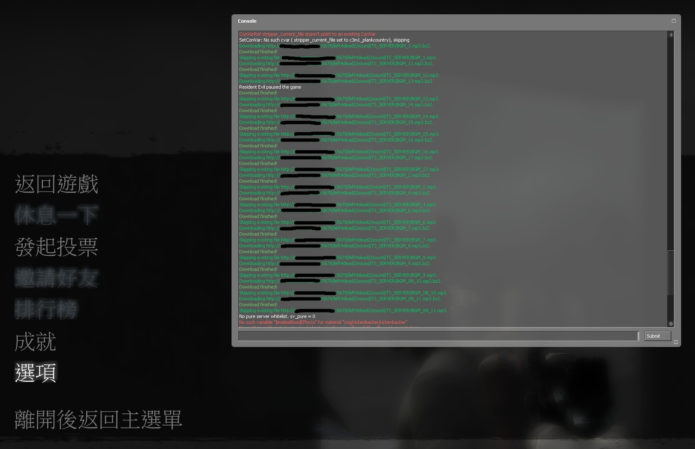
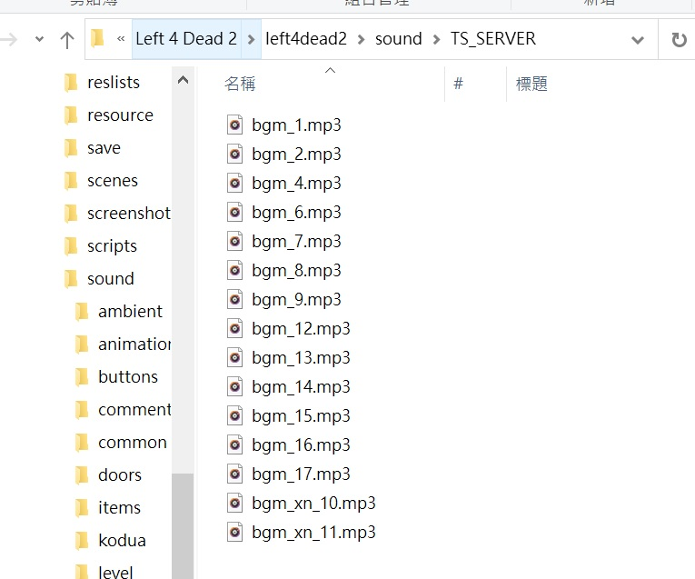

# Description | 內容
SM File/Folder Downloader and Precacher
(Client will download custom files when connecting server)

* Video | 影片展示
<br/>None

* Image | 圖示
	* client connecting server and downloading custom files (玩家連線伺服器時下載自製的檔案)
	<br/>

* Require | 必要安裝
<br/>None

* <details><summary>ConVar | 指令</summary>

    * cfg/sourcemod/map-decals.cfg
		```php
		// (Download & Precache) Full path of the normal downloader configuration to load. 
		// IE: configs/sm_downloader/downloads.ini
		sm_downloader_config "configs/sm_downloader/downloads.ini"

		// 0=Plugin off, 1=Plugin on.
		sm_downloader_enabled "1"

		// If 1, Enable normal downloader file.
		sm_downloader_normal "1"

		// If 1, Enable simple downloader file.
		sm_downloader_simple "0"

		// (Download Only No Precache) Full path of the simple downloader configuration to load. 
		// IE: configs/sm_downloader/downloads_simple.ini
		sm_simple_downloader_config "configs/sm_downloader/downloads_simple.ini"
		```
</details>

* <details><summary>Command | 命令</summary>

	None
</details>

* <details><summary>Data Example</summary>

	* [configs\sm_downloader\downloads.ini](addons\sourcemod\configs\sm_downloader\downloads.ini), this is normal downloader configuration
		```php
		//Don't modify or remove the Comment Lines ( // )
		//Can not download .VPK files 
		//Files (Download Only No Precache)
		path/anymap.ext
		path/anymap2.ext

		//Decal Files (Download and Precache)
		materials/decals/anymap.vmt
		materials/decals/anymap.vtf

		//Sound Files (Download and Precache)
		sound/misc/Anymap.wav
		sound/misc/Anymap3.wav

		//Model Files (Download and Precache)
		models/parachute/parachute_green.mdl
		```

	* [configs\sm_downloader\downloads_simple.ini](addons\sourcemod\configs\sm_downloader\downloads_simple.ini), this is simple downloader configuration (Download Only No Precache)
		```php
		path/anymap.ext
		path/anymap2.ext

		materials/decals/anymap.vmt
		materials/decals/anymap.vtf

		sound/misc/Anymap.wav
		sound/misc/Anymap3.wav

		models/parachute/parachute_green.mdl
		```

	> __Note__ If you don't know which file should use, just enable and use [configs\sm_downloader\downloads.ini](addons\sourcemod\configs\sm_downloader\downloads.ini)
</details>

* <details><summary>How to make the client download custom files</summary>

	1. Preparation of custom files
		* Prepare your custom files.
		* Put them in your game folder
    		* If L4D1, ```Left 4 Dead Dedicated Server\left4dead```
    		* If L4D2, ```Left 4 Dead 2 Dedicated Server\left4dead2```
		* Add the path of each files to the downloader configuration "configs\sm_downloader\downloads.ini" or "configs\sm_downloader\downloads_simple.ini". 
    		* If L4D1, the path has to be put relative to the "left4dead" folder, and with the file extension.
    		* If L4D2, the path has to be put relative to the "left4dead2" folder, and with the file extension.
		* Prepare your content-server for FastDL, if you don't know what "FastDL" is, please google it

	2. Setup server to work with downloadable content
		* ConVars in your cfg/server.cfg should be:
			* If you are L4D1
				```php
				sm_cvar sv_allowdownload "1"
				sm_cvar sv_downloadurl "http://your-content-server.com/game/left4dead/"
				```
			* If you are L4D2
				```php
				sm_cvar sv_allowdownload "1"
				sm_cvar sv_downloadurl "http://your-content-server.com/game/left4dead2/"	
				```

	3. Uploading files to server.
		* Upload all your custom files to content-server
			* If you are L4D1, ```your-content-server.com/game/left4dead/```
			* If you are L4D2, ```your-content-server.com/game/left4dead2/```
		* Upload all your custom files to your game server
    		* If you are L4D1, ```Left 4 Dead Dedicated Server\left4dead```
    		* If you are L4D2, ```Left 4 Dead 2 Dedicated Server\left4dead2```

	4. Start the server and test
		* Launch your game, Options-> Multiplayer -> CUSTOM SERVER CONTENT -> Allow All
		<br/>
		* Connect to server. 
		* Open console to see if the game is downloading files from server
		<br/>
		* Browse your game folder, check files are already there.
		<br/>
</details>

* Apply to | 適用於
	```
	L4D1
	L4D2
	```

* <details><summary>Changelog | 版本日誌</summary>

    * 2.0 (2023-12-6)
		* Fixed not downloading custom files on the first map after server startup 
		
    * 1.9 (2023-9-27)
		* Fixed custom sound not Precache

    * 1.8 (2023-5-4)
		* Fixed custom spray blocked and fail to download

    * 1.7 (2022-11-16)
	    * Remake Code
		* Auto-generate cfg

    * v1.4
	    * [original plugin by berni](https://forums.alliedmods.net/showthread.php?t=69502)
</details>

- - - -
# 中文說明
SM 文件下載器 (玩家連線伺服器的時候能下載自製的檔案)

* 原理
	* 將你自己的自製檔案(貼圖、音樂、模組等等)準備好
	* 請自備網空，玩家連線的時候會從網空伺服器上下載自製的檔案
	* [下載自訂伺服器內容](https://github.com/fbef0102/Game-Private_Plugin/tree/main/Tutorial_%E6%95%99%E5%AD%B8%E5%8D%80/Chinese_%E7%B9%81%E9%AB%94%E4%B8%AD%E6%96%87/Game#%E4%B8%8B%E8%BC%89%E8%87%AA%E8%A8%82%E4%BC%BA%E6%9C%8D%E5%99%A8%E5%85%A7%E5%AE%B9)

* <details><summary>Data設定範例</summary>

	* [configs\sm_downloader\downloads.ini](addons\sourcemod\configs\sm_downloader\downloads.ini), 這是正常版的檔案下載設定文件
		```php
		//不要移除任何原有的符號 ( // )
		//不能傳輸.vpk檔案
		//Files (只下載不預緩存)
		path/anymap.ext
		path/anymap2.ext

		//Decal Files (下載並預緩存)
		materials/decals/anymap.vmt
		materials/decals/anymap.vtf

		//Sound Files (下載並預緩存)
		sound/misc/Anymap.wav
		sound/misc/Anymap3.wav

		//Model Files (下載並預緩存)
		models/parachute/parachute_green.mdl
		```

	* [configs\sm_downloader\downloads_simple.ini](addons\sourcemod\configs\sm_downloader\downloads_simple.ini), 這是簡單版的檔案下載設定文件 (只下載不預緩存)
		```php
		path/anymap.ext
		path/anymap2.ext

		materials/decals/anymap.vmt
		materials/decals/anymap.vtf

		sound/misc/Anymap.wav
		sound/misc/Anymap3.wav

		models/parachute/parachute_green.mdl
		```

	> __Note__ 如果你不知道這兩設定文件有捨差別, 建議你一律使用[configs\sm_downloader\downloads.ini](addons\sourcemod\configs\sm_downloader\downloads.ini)
</details>

* <details><summary>玩家如何下載檔案?</summary>

	1. 準備你的自製檔案
		* 準備好你的所有自製檔案(貼圖、音樂、模組等等)
		* 文件名
			* 確保沒有文件有空格或特殊字符，如“長破折號”(–) 等。
			* 不能有中文
		* 將它們放在遊戲伺服器資料夾中
    		* 如果你是 L4D1，```Left 4 Dead Dedicated Server\left4dead```
    		* 如果你是 L4D2，```Left 4 Dead 2 Dedicated Server\left4dead2```
		* 將每個檔案的路徑添加到檔案下載設定文件"configs\sm_downloader\downloads.ini"或"configs\sm_downloader\downloads_simple.ini"。
    		* 如果你是 L4D1，路徑必須相對於"left4dead" 資料夾，必須要寫上副檔名。
    		* 如果你是 L4D2，路徑必須相對於"left4dead2" 資料夾，必須要寫上副檔名。
		* 準備好你的網空並可以支援FastDL, 不知道什麼是FastDL請自行Google
		
	2. 設置伺服器以處理可下載的內容
		* 寫入以下內容到cfg/server.cfg
			* 如果你是 L4D1
				```php
				sm_cvar sv_allowdownload "1"
				sm_cvar sv_downloadurl "http://your-content-server.com/game/left4dead/"
				```
			* 如果你是 L4D2
				```php
				sm_cvar sv_allowdownload "1"
				sm_cvar sv_downloadurl "http://your-content-server.com/game/left4dead2/"	
				```
		
	3. 上傳文件到伺服器
		* 所有自製的檔案上傳到網空伺服器。
    		* 如果你是 L4D1，```your-content-server.com/game/left4dead/```
    		* 如果你是 L4D2，```your-content-server.com/game/left4dead2/```
		* 所有自製的檔案複製到您的遊戲伺服器資料夾上。
    		* 如果你是 L4D1，```Left 4 Dead Dedicated Server\left4dead```
    		* 如果你是 L4D2，```Left 4 Dead 2 Dedicated Server\left4dead2```
		
	4. 啟動伺服器並測試
		* 打開你的遊戲，選項->多人連線->自訂伺服器內容->全部允許
		<br/>
		* 連線到伺服器
		* 打開控制台查看是否下載自製的檔案 (此處圖片顯示正在下載音樂)
		<br/>
		* 再去你的遊戲資料夾查看檔案是否已經下載 
		<br/>
</details>