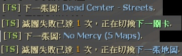

# Description | 內容
Force change to next mission when current mission(final stage) end + Force change to next level when survivors wipe out (Apply to survival).

> __Note__ This Plugin has been discontinued, [New Version here](https://github.com/fbef0102/Game-Private_Plugin/tree/main/Plugin_%E6%8F%92%E4%BB%B6/Map_%E9%97%9C%E5%8D%A1/sm_l4d_mapchanger)

* [Video | 影片展示](https://youtu.be/ehyyDp0RCMQ)

* Image | 圖示
	* Next Map
		> 下一張地圖
		<br/>

* Apply to | 適用於
    ```
    L4D1 coop/survival/versus
    L4D2 coop/survival/versus/realism
    ```

* Translation Support | 支援翻譯
	```
	English
	繁體中文
	简体中文
	```

* <details><summary>Changelog | 版本日誌</summary>

	```php
	//Dionys @ 2008~2009
	//Harry @ 2019~2023
	```
    * v2.6 (2023-3-30)
		* Block players from returning to lobby in coop final or versus final while change to next map 

    * v2.5 (2023-1-12)
	    * [AlliedModder Post](https://forums.alliedmods.net/showpost.php?p=2728817&postcount=676)
	    * Remake Code
	    * Translation Support
	    * Support L4D2 coop/versus/realism/survival mode
	    * Support normal stage and final stage
	    * After several round end events(tries) survivors wipe out, force server to change map (next level or next map).
		* Support Survival

    * v1.4
	    * [Original Post by Dionys](https://forums.alliedmods.net/showthread.php?t=81982)
</details>

* Require | 必要安裝
	1. [left4dhooks](https://forums.alliedmods.net/showthread.php?t=321696)
	2. [[INC] Multi Colors](https://github.com/fbef0102/L4D1_2-Plugins/releases/tag/Multi-Colors)

* Related Plugin | 相關插件
	1. [l4d_restartmap_command](https://github.com/fbef0102/Game-Private_Plugin/tree/main/Plugin_%E6%8F%92%E4%BB%B6/Map_%E9%97%9C%E5%8D%A1/l4d_restartmap_command): Admin say !restartmap to restart current map + Force of restartmap after Quantity of rounds (tries) events survivors wipe out
    	> 管理員輸入!restartmap能重新地圖關卡 + 滅團N次後重新地圖

	2. [l4d_random_map_vote](https://github.com/fbef0102/Game-Private_Plugin/tree/main/Plugin_%E6%8F%92%E4%BB%B6/Map_%E9%97%9C%E5%8D%A1/l4d_random_map_vote):Vote to change map, the map is chosen randomly from data
    	> 投票更換地圖，但是地圖是隨機挑選的

* <details><summary>ConVar | 指令</summary>

	* cfg\sourcemod\sm_l4d_mapchanger
		```php
		// Enables next mission and how many chances left to advertise to players.
		sm_l4d_fmc_announce "1"

		// Quantity of rounds (tries) events survivors wipe out before force of changelevel on final maps in coop/realism (0=off)
		sm_l4d_fmc_crec_coop_final "3"

		// Quantity of rounds (tries) events survivors wipe out before force of changelevel on non-final maps in coop/realism (0=off)
		sm_l4d_fmc_crec_coop_map "3"

		// Quantity of rounds (tries) events survivors wipe out before force of changelevel in survival. (0=off)
		sm_l4d_fmc_crec_survival_map "5"

		// Mission for change by default on final map in coop/realism.
		sm_l4d_fmc_def_coop "c2m1_highway"

		// Mission for change by default in survival.
		sm_l4d_fmc_def_survival "c5m5_bridge"

		// Mission for change by default on final map in versus.
		sm_l4d_fmc_def_versus "c8m1_apartment"

		// After final rescue vehicle leaving, delay before force of changelevel in coop/realism. (0=Don't force to change map)
		sm_l4d_fmc_delay_coop_final "15.0"

		// After quantity of rounds end in survival, delay before force of changelevel in survival. (0=Don't force to change map)
		sm_l4d_fmc_delay_survival "15.0"

		// After final map finishes, delay before force of changelevel in versus. (0=Don't force to change map)
		sm_l4d_fmc_delay_vs "13.0"
		```
</details>

* <details><summary>Command | 命令</summary>
    
   * **Display Next Map**
		```php
		sm_fmc_nextmap
		sm_fmc
		```
</details>

* Example Config
	* data\sm_l4d_mapchanger.txt
		```php
		"ForceMissionChangerSettings"
		{
			"c1m4_atrium"   // current map
			{
				"next mission map" "c2m1_highway"   					// <-- next map in coop/versus/realism
				"next mission name" "黑色嘉年華 Dark Carnival (5 Maps)" // <-- map name whatever
			}
			"c8m5_rooftop" // current map
			{
				"next mission map" "c9m2_lots"   				// <-- next map in coop/versus/realism
				"next mission name" "Crash Course (2 Maps)"  	// <-- map name whatever
				
				"survival_nextmap" "c1m2_streets"			 	// <-- next map in survival mode
				"survival_nextname" "Dead Center - Streets" 	// <-- map name whatever
			}
		} 
		```

- - - -
# 中文說明
最後一關結束時自動換圖 + 滅團N次後切換到下一個關卡 (生存模式也適用)

> __Note__ 此插件已停止更新，如要更多功能，[新版插件請點擊這裡](https://github.com/fbef0102/Game-Private_Plugin/tree/main/Plugin_%E6%8F%92%E4%BB%B6/Map_%E9%97%9C%E5%8D%A1/sm_l4d_mapchanger)
> * 玩家可以投票下一張地圖
> * 清道夫模式也適用

* 原理
    * 戰役/寫實模式中當倖存者滅團超過N次時，自動切換到下一個關卡
		* 適合用在非常多特效與高難度的戰役伺服器，避免一直卡在同一個關卡，玩家也會疲勞
	* 戰役/寫實模式中最後一關當倖存者滅團超過N次時或成功通關時，自動切換到下一張地圖
	* 對抗模式中最後一關當雙方回合結束之時，自動切換到下一張地圖
    * 生存模式中當倖存者滅團超過N次時，自動切換到下一張地圖

* 功能
	* 可設定滅團的次數，請查看指令
	* 可設定文件決定切換到哪一張地圖

* 文件設定
	* data\sm_l4d_mapchanger.txt
		```php
		"ForceMissionChangerSettings"
		{
			"c1m4_atrium"   // 當前地圖
			{
				"next mission map" "c2m1_highway"   					// <-- 戰役/對抗/寫實模式 下一張地圖名 (也可以寫三方圖)
				"next mission name" "黑色嘉年華 Dark Carnival (5 Maps)" // <-- 名稱自取
			}
			"c8m5_rooftop" // 當前地圖
			{
				"next mission map" "c9m2_lots"   				// <-- 戰役/對抗/寫實模式 下一張地圖名 (也可以寫三方圖)
				"next mission name" "Crash Course (2 Maps)"  	// <-- 名稱自取
				
				"survival_nextmap" "c1m2_streets"			 	// <-- 生存模式 下一張地圖名 (也可以寫三方圖)
				"survival_nextname" "Dead Center - Streets" 	// <-- 名稱自取
			}
		} 
		```
