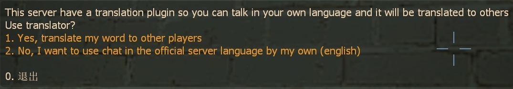
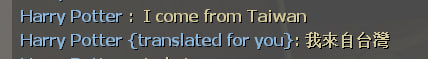
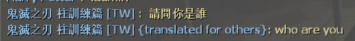
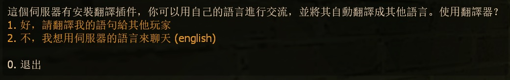

# Description | 內容
Translate chat message via Google API

* Video | 影片展示
<br/>None

* Image | 圖示
    <br/>
    <br/>
    <br/>

* <details><summary>How does it work?</summary>

	* Display menu when new player joins server 
        -> Choose "Yes, translate my words to other player" 
        -> Your chat messages will be translated into other player depends on their steam language
    * You can define the official server language on ```addons/sourcemod/configs/core.cfg``` -> "ServerLang" keyvalue.
    * The translation is using Google Translation API
        * May not working if Google is blocked in your Country/Region
</details>

* Require | 必要安裝
    1. [[INC] Multi Colors](https://github.com/fbef0102/L4D1_2-Plugins/releases/tag/Multi-Colors)
    2. [[INC] sm-json](https://github.com/clugg/sm-json)
    3. [SteamWorks](https://github.com/hexa-core-eu/SteamWorks/releases)

* <details><summary>ConVar | 指令</summary>

    * cfg/sourcemod/sm_translator.cfg
        ```php
        // 0=Plugin off, 1=Plugin on.
        sm_translator_enable "1"

        // When new player connects, 0=Display menu to ask if player 'yes' or 'no', 1=Auto enable translator for player + Don't display menu
        sm_translator_default "0"
        ```
</details>

* <details><summary>Command | 命令</summary>

	* **Open translator menu**
		```php
		sm_translator
		```
</details>

* Apply to | 適用於
    ```
    L4D1
    L4D2
    ```

* <details><summary>Translation Support | 支援翻譯</summary>

	```
	English
	繁體中文
	简体中文
	```
</details>

* <details><summary>Changelog | 版本日誌</summary>

    * v1.4h (2024-9-22)
        * Block chat translation if different team
        * Update translation

    * v1.3h (2024-9-21)
    * v1.2h (2024-9-20)
        * Update cvars

    * v1.1h (2024-9-9)
        * Fixed memory leak

    * v1.0h (2024-6-16)
        * Use Google Translation API
        * Add json inc
        * Update translation

    * v1.0
        * [Original Plugin by Franc1sco](https://forums.alliedmods.net/showthread.php?t=306279)
</details>

- - - -
# 中文說明
翻譯你的句子給其他玩家 (玩家對應的語言)

* 圖示
    <br/>

* 原理
    * 進入伺服器之後顯示選單 -> 選擇"好..." -> 你打字聊天的內容會自動翻譯給其他玩家 (根據他們的steam平台設置的語言)
    * 伺服器語言預設是英文，可於 ```addons/sourcemod/configs/core.cfg``` 設置 -> "ServerLang" 參數

* 注意事項
    * 使用的是Google提供的API翻譯，所以可能翻譯得不正確
    * 如果你所在的地區無法上Google網站，可能無法使用此插件

* <details><summary>指令中文介紹 (點我展開)</summary>

    * cfg/sourcemod/sm_translator.cfg
        ```php
        // 1=開啟插件. 0=關閉插件
        sm_translator_enable "1"

        // 當玩家近來伺服器時, 0=彈出選單詢問玩家是否自動翻譯, 1=自動幫玩家翻譯 + 不彈出選單
        sm_translator_default "0"
        ```
</details>

* <details><summary>命令中文介紹 (點我展開)</summary>

	* **打開選單**
		```php
		sm_translator
		```
</details>