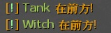

# Description | 內容
When the tank and witch spawns, it announces itself in chat by making a sound

* Video | 影片展示
<br/>None

* Image | 圖示
	<br/>

* Require | 必要安裝
	1. [[INC] Multi Colors](https://github.com/fbef0102/L4D1_2-Plugins/releases/tag/Multi-Colors)

* <details><summary>ConVar | 指令</summary>

	* cfg/sourcemod/tank_witch_spawn_notify.cfg
        ```php
		// If 1, announce chat when tank spawns
		tank_witch_spawn_notify_tank_announce "1"

		// Tank sound file (relative to to sound/, empty=Disable)
		tank_witch_spawn_notify_tank_sound_file "ui/pickup_secret01.wav"

		// If 1, announce chat when witch spawns
		tank_witch_spawn_notify_witch_announce "1"

		// Witch sound file (relative to to sound/, empty=Disable)
		tank_witch_spawn_notify_witch_sound_file "ui/pickup_secret01.wav"
        ```
</details>

* <details><summary>Command | 命令</summary>

	None
</details>

* Apply to | 適用於
    ```
    L4D1
    L4D2
    ```

* <details><summary>Translation Support | 支援翻譯</summary>

	```
	English
	繁體中文
	简体中文
	```
</details>

* <details><summary>Changelog | 版本日誌</summary>

	* 1.0
		* Initial Release
</details>

- - - -
# 中文說明
Tank/Witch出現有提示與音效

* 原理
	* 遊戲出現Tank時有提示與音效
    * 遊戲出現Witch時有提示與音效

* 功能
	* 可更改音效檔案
	* 可調整是否要提示