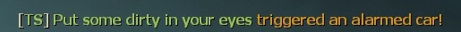
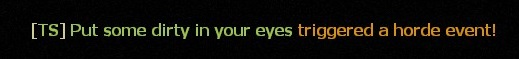
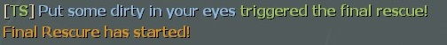

# Description | 內容
Who called the horde ?

* Video | 影片展示
<br/>None

* Image | 圖示
	* Alarmed car
		> 顯示誰觸發了警報車
		<br/>
	* Horde event
		> 顯示誰觸發了機關屍潮
		<br/>
	* Final rescue
		> 顯示誰啟動了最後救援
		<br/>

* Apply to | 適用於
    ```
    L4D1
    L4D2
    ```

* Translation Support | 支援翻譯
	```
	English
	繁體中文
	简体中文
	```

* <details><summary>Changelog | 版本日誌</summary>

	* v1.0
		* Request by Yabi
        * Intital Release
		* Thanks to [Forgetest](https://github.com/jensewe) for gamedata
</details>

* Require | 必要安裝
	1. [left4dhooks](https://forums.alliedmods.net/showthread.php?t=321696)
	2. [[INC] Multi Colors](https://forums.alliedmods.net/showthread.php?t=247770)

* <details><summary>ConVar | 指令</summary>

	* cfg/sourcemod/trigger_horde_notify.cfg
        ```php
		// (L4D2) If 1, Notify who tirggers the alarm car.
		trigger_horde_notify_alarm_car "1"

		// Cold down time to notify again.
		trigger_horde_notify_cool_down_time "30.0"
        ```
</details>

* <details><summary>Command | 命令</summary>

	None
</details>

- - - -
# 中文說明
顯示誰觸發了屍潮事件

* 原理
	* 顯示誰啟動了機關屍潮
	* 顯示誰觸發了警報車
	* 顯示誰啟動了最後救援

* 功能
	* 可控制誰觸發了警報車提示開關
	* 可控制屍潮提示間隔 (避免無限屍潮的事件一直提示)

* 注意事項
    * 在二代裡非所有地圖機關會提示誰觸發，認真你就輸了